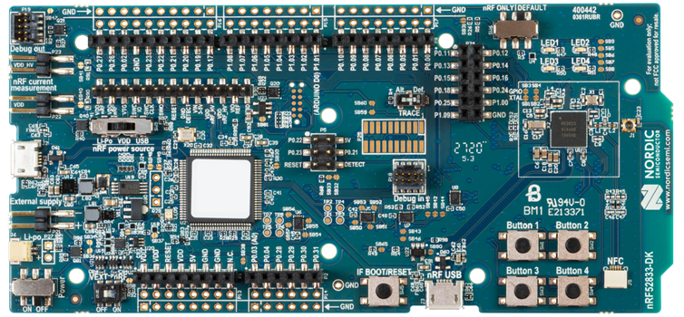

footer: Carsten Wulff 2022
slidenumbers:true
autoscale:true
theme: Plain Jane, 1
text:  Helvetica
header:  Helvetica

<!--pan_title: SUN Input/Output and electrostatic discharge  -->

<!--pan_skip: -->

## TFE4188 - Lecture 2
# ESD and I/O

---
<!--pan_skip: -->

# Housekeeping

Groups sets on blackboard, make sure you sign up this week. The username you get does not have to correspond to your AIC group name. 

Change of review plan. Moved spec, design, layout and tapeout review to better match exercises

According to the updated plan, we'll have the specification review in two weeks. To
complete that, you should fill in a confluence page with the plan for the design. Follow [Specification Checklist](https://www.ntnu.no/wiki/display/tfe4487/Specifcation+Review)

Exam will likely be oral

Will start f2f lectures from next week (24'th of January) in F6 gamle fysikk

---
<!--pan_skip: -->
| Week | Book                 | Monday                                                                       | Project plan             | Exercise |
|------|----------------------|------------------------------------------------------------------------------|--------------------------|----------|
| 2    | CJM 1-6              | Course intro, what I expect you to know, project, analog design fundamentals | Specification            |          |
| 3    | Slides               | ESD and IC Input/Output                                                      | Specification            | x        |
| 4    | CJM 7,8              | Reference and bias                                                           | Specification            |          |
| 5    | CJM 12               | Analog Front-end                                                             | M1. Specification review | x        |
| 6    | CJM 11-14            | Switched capacitor circuits                                                  | Design                   |          |
| 7    | JSSC, CJM 18         | State-of-the-art ADCs                                                        | Design                   | x        |
| 8    | Slides               | Low power radio recievers                                                    | Design                   |          |
| 9    | Slides               | Communication standards from circuit perspective                             | M2. Design review        | x        |
| 10   | CJM 7.4, CFAS,+DC/DC | Voltage regulation                                                           | Layout                   |          |
| 11   | CJM 19, CFAS         | Clock generation                                                             | M3. Layout review        | x        |
| 12   | Paper                | Energy sources                                                               | Layout/LPE simulation    |          |
| 13   | Slides               | Chip infrastructure                                                          | Layout/LPE simulation    | x        |
| 14   |                      | Tapeout review                                                               | M4. Tapeout review       |          |
| 15   |                      | Easter                                                                       |                          |          |
| 16   |                      | Easter                                                                       |                          |          |
| 17   |                      | Exam repetition                                                              |                          |          |

---
<!--pan_skip: -->
# Goal for today

Understand the **real-world** constraints on our IC

Understand why you must **always handle ESD** on an IC

---

#[fit] SUN

<!--pan_doc:

The project for 2022 is to create something that senses the real world. The plan is at some point
to tapeout the IC.

To measure the circuits we need a measurement setup, and a printed circuit board. We don't want to develop everything though. 
We don't want to make the interface to the computer, nor the power supply nor the microcontroller to read the IC. 

The quickest way is to leverage existing hardware. And I know how to program the nRF52 development boards.

-->

---

**Plan**: Make SUN PCB as a shield on top of a nRF52xxx Design Kit

---

<!--pan_doc:

The 3.0 V from the DK will connect to the VDD of SUN, while the 1.5 V is by an internal LDO. The control shift register, 
the TDX output from SUN will connect to the general purpose input/output (GPIO) on nRF52. The asyncrhonous reset will also connect to
a GPIO, but here we'll also include a physical button on the board. Maybe even leverage the same net as the reset pin on the nRF52 DK.

-->

---

| Name    | Min/Typ/Max  | Comment               |
|---------|:------------:|-----------------------|
| VDD     | 2.4 / 3.0 / 3.6  | Supplied from nRF52DK. Second midlayer on SUN PCB |
| VDD_1V5 | 1.35 / 1.5 / 1.65 | Internal LDO on SUN (Optional)   |
| VSS     | 0    | First midlayer on SUN PCB |

**Purpose**
- Provide power to the IC
- Provide path for ESD currents

<!--pan_skip: -->

---

**CK16KI**
Digital output from LFXO on nRF52 (32768/2) via GPIOTE. Digital input on SUN

**CK8M** [^1]
Digital output from HFCLK on nRF52 via PPI to GPIOTE. Digital input on SUN

[^1]: After some thought. I don't think I can get 16MHz clock out of nRF52. The GPIO on nRF52 runs at 16 MHz, so 8 MHz is probably the highest we can go.

---
**ARST_N**
Active low reset. 

Output from nRF52 GPIO so we can do software reset, but also include a reset button on the PCB, just in case. 

Ensures that all flip-flops are in a known state before we start to configure SUN

<!--pan_skip: -->

---
**Control**

| Name  | Note        | SUN    |
|-------|-------------|--------|
| SLOAD | Serial load | Input  |
| SCK   | Shift clock | Input  |
| SI    | Shift in    | Input  |
| SO    | Shift out   | Output |

Long shift register. Bit bang SI and SCK from nRF52. When all bits are shifted in, then set SLOAD high to load the control word.

<!--pan_skip: -->

---
**TXD and TXD_CK**

| Name    | Note                                 | SUN    |
|---------|--------------------------------------|--------|
| TXD     | 12-bit Digital output                | Output |
| TXD\_CK | Sample TXD on rising edge of TXD\_CK | Output |

If nRF52 is not fast enough to capture TXD at full speed, or has enough RAM to store values, then use Saleae logic analyzer.

---
# Pin types on SUN

| Type                        | Name      | Level | ESD                                            |
|-----------------------------|-----------|-------|------------------------------------------------|
| Supply connected to IO ring | P\_VH\_EV | VDD   | Connected to VDD rail. Core clamp to VSS rail  |
| Supply to core              | P\_VC\_EV | VDD   | Pin clamp to VDD and VSS                       |
| VSS                         | P\_VL\_EV | VDD   | Connected to VSS rail                          |
| Digital input               | P\_DI\_EV | VDD   | Pin clamp to VDD and VSS. Secondary protection |
| Digital output              | P\_DO\_EV | VDD   | Pin clamp to VDD and VSS.                       |

---

<!--pan_skip: -->

# The **real world** constrains our IC

Know how the real system looks before you make your design. 

What limits voltage, temperature, input/output in testing?

---
<!--pan_skip: -->
#[fit] ESD

---

# Electrostatic Discharge 

If you make an IC, you must consider Electrostatic Discharge (ESD) Protection circuits

<!--pan_doc: 

ESD events are tricky. They are short (ns), high current (Amps) and poorly modeled in the SPICE model. 
Most SPICE models will not model correctly what happens to an transistor during an ESD event.

But ESD design is a must, you have to think about ESD, otherwise your design will never work. 

Consider a certain ESD specification, for example 1 kV human body model, a requirement for an integrated circuit. 
By requirement I mean if the 1 kV is not met, then the project will be delayed until it is fixed. If it's not fixed, then the
project will be infinietly delayed, or in other words, cancelled.

Now imagine it's your responsibility to ensure it meets the 1 kV specification, what would you do? I would recommend you read one
of the few ESD books in existence, shown below, and rely on you understanding of PN-junctions.

-->

<!--pan_doc: 

The industry has agreed on some common test criteria for electrostatic discharge.

-->

Standards for testing at [JEDEC](https://www.jedec.org/category/technology-focus-area/esd-electrostatic-discharge-0)

---

## When do ESD events occur?

[.column]

__Before or during mounting on PCB__ 

Human body model (HBM)

Charged device model (CDM)

[.column]

__After mounting on PCB__

Human body model (HBM) 

System level ESD 

---
## Human body model (HBM)

- Models a person touching a device with a finger
- **Long** duration (around 100 ns)
- Acts like a current source into a pin
- Can usually be handled in the I/O ring
- 4 kV HBM ESD is 2.67 A peak current

---

---
**What could we do for VSS to VDD?**

---
**What could we do for VDD to VSS?**

---
**What could we do for PIN to VSS?**

---
**What could we do for VSS to PIN?**

---

---

GGNMOS: Avalanche

---

GGNMOS: Bulk

---

GGNMOS: $$D_{sb}$$ forward bias

---

GGNMOS: What next?

---

If you don't do the layout right[^3]

[.column]

 

[.column]

[^3]: [New Ballasting Layout Schemes to Improve ESD Robustness of I/O Buffers in Fully Silicided CMOS Process](https://ieeexplore.ieee.org/stamp/stamp.jsp?arnumber=5299049)

---

You must **always handle ESD** on an IC

- Do everything yourself
- Use libraries from foundry (gf013_esd)
- Get help [www.sofics.com](http://www.sofics.com)

---

#[fit] Thanks!

