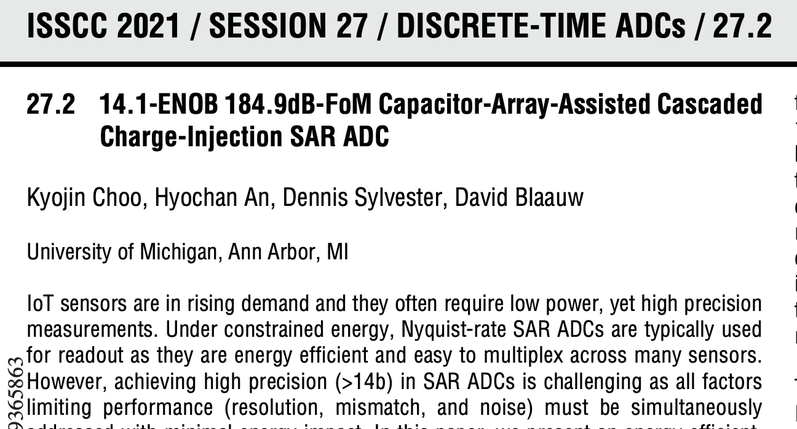

footer: Carsten Wulff 2022
slidenumbers:true
autoscale:true
theme: Plain Jane, 1
text:  Helvetica
header:  Helvetica

## TFE4188 - Lecture 6
# State-of-the-art ADCs

---

# Housekeeping

Next week (21'st of February) is digital on Teams. Lecture on Panopto, session will be purely Q&A

---

[.column]


#[fit] Verilog-A

[.column]

```verilog
`include "constants.vams"
`include "disciplines.vams"

module SUN_WF_TEMP1(T_ON, T_OP, TREQ_1V5, VDD_1V5, VSS);
   output T_ON, T_OP;
   input  TREQ_1V5,VDD_1V5,VSS;
   electrical T_ON,T_OP,TREQ_1V5,VDD_1V5,VSS;
 
   real   dvbe;
   analog begin
      @(initial_step) begin
         dvbe = 0;
      end

      if(V(TREQ_1V5) > V(VDD_1V5)/2) begin
         dvbe = $vt*ln(8);
      end
      else begin
         dvbe =0;
      end

      V(T_ON) <+ 0;
      V(T_OP) <+ transition(dvbe,10p, 10p);
   end

endmodule
```


---

| Week | Book                 | Monday                                                                       | Project plan             | Exercise |
|------|----------------------|------------------------------------------------------------------------------|--------------------------|----------|
| 2    | CJM 1-6              | Course intro, what I expect you to know, project, analog design fundamentals | Specification            |          |
| 3    | Slides               | ESD and IC Input/Output                                                      | Specification            | x        |
| 4    | CJM 7,8              | Reference and bias                                                           | Specification            |          |
| 5    | CJM 12               | Analog Front-end                                                             | M1. Specification review | x        |
| 6    | CJM 11-14            | Switched capacitor circuits                                                  | Design                   |          |
| 7    | JSSC, CJM 18         | **State-of-the-art ADCs**                                                      | Design                   | x        |
| 8    | Slides               | Low power radio recievers                                                    | Design                   |          |
| 9    | Slides               | Communication standards from circuit perspective                             | M2. Design review        | x        |
| 10   | CJM 7.4, CFAS,+DC/DC | Voltage regulation                                                           | Layout                   |          |
| 11   | CJM 19, CFAS         | Clock generation                                                             | M3. Layout review        | x        |
| 12   | Paper                | Energy sources                                                               | Layout/LPE simulation    |          |
| 13   | Slides               | Chip infrastructure                                                          | Layout/LPE simulation    | x        |
| 14   |                      | Tapeout review                                                               | M4. Tapeout review       |          |
| 15   |                      | Easter                                                                       |                          |          |
| 16   |                      | Easter                                                                       |                          |          |
| 17   |                      | Exam repetition                                                              |                          |          |


---

# Goal for today

Understand **why** there are different ADCs

Introduction to **delta-sigma** modulators

---

[1999, R. Walden: Analog-to-digital converter survey and analysis](https://ieeexplore.ieee.org/stamp/stamp.jsp?tp=&arnumber=761034)


---

[B. Murmann, ADC Performance Survey 1997-2021 (ISSCC & VLSI Symposium)](https://web.stanford.edu/~murmann/adcsurvey.html)


 


$$ FOM_W = \frac{P}{2^B f_s}$$ 

Below $$ 10 fJ/conv.step$$ is good

Below $$ 1 fJ/conv.step$$ is extreme

---

[B. Murmann, ADC Performance Survey 1997-2021 (ISSCC & VLSI Symposium)](https://web.stanford.edu/~murmann/adcsurvey.html)


$$FOM_S = SNDR + 10\log\left(\frac{f_s/2}{P}\right)$$ 

Above $$ 180 dB$$ is extreme

---

[https://ieeexplore.ieee.org/document/9365863](https://ieeexplore.ieee.org/document/9365863)




---

#[fit] Quantization

---


---


---


---

[.column]

$$e_n(t) = \sum_{p=1}^\infty{A_p\sin{p\omega t}}$$

where p is the harmonic index, and

 $$
A_p = 
\begin{cases}
\delta_{p1}A  + \sum_{m =
  1}^\infty{\frac{2}{m\pi}J_p(2m\pi A)} &, p = \text{ odd} \\
 0 &, p = \text{ even}
\end{cases}
$$

 $$
\delta_{p1}
\begin{cases}
1 &, p=1 \\
0 &, p \neq 1
\end{cases}
$$


and $$J_p(x)$$ is a Bessel function of the first kind, $$A$$ is the amplitude of the input signal.

[.column]

If we approximate the amplitude of the input signal as 

$$A = \frac{2^n - 1}{2} \approx 2^{n-1}$$

where n is the number of bits, we can rewrite as .... 


<sub> See [The intermodulation and distortion due to quantization of sinusoids](https://ieeexplore.ieee.org/document/1164729) </sub>


---

$$e_n(t) = \sum_{p=1}^\infty{A_p\sin{p\omega t}}$$

$$ A_p = \delta_{p1}2^{n-1} + \sum_{m=1}^\infty{\frac{2}{m\pi}J_p(2m\pi
  2^{n-1})},  p=odd$$

---


---


$$ k_x = \frac{\Delta}{\sqrt{12}}\sqrt{\frac{1}{fs}}$$

---

$$ SQNR = 10 \log\left(\frac{A^2/2}{\Delta^2/12}\right) = 10 \log\left(\frac{6 A^2}{\Delta^2}\right) $$

$$ \Delta = \frac{2A}{2^B}$$

$$ SQNR = 10 \log\left(\frac{6 A^2}{4 A^2/2^B}\right) = 20 B \log 2 + 10 \log 6/4$$

$$ SQNR  \approx 6.02 B + 1.76$$

---

#[fit] Oversampling

---


---


In-band quantization noise $$ \frac{\Delta^2}{12 OSR}$$

$$ SQNR = 10 \log\left(\frac{6 A^2}{\Delta^2/OSR}\right)$$ 
$$ = 10 \log\left(\frac{6 A^2}{\Delta^2}\right) + 10 \log(OSR)$$

$$ SQNR \approx 6.02B + 1.76 + 10 \log(OSR)$$ 


$$ 10 \log(2) \approx 3 dB$$
$$ 10 \log(4) \approx 6 dB$$


**0.5-bit per doubling of OSR**

---


---

#[fit] Noise Shaping

---


---


---


--

--


 $$ y[n] = e[n] + h*(u[n] - y[n])$$

 $$ Y(z) = E(z) + H(z)\left[U(z) - Y(z)\right]$$

 Assume U and E are uncorrelated
 
---


--

--

 $$ Y(z) = E(z) + H(z)\left[U(z) - Y(z)\right]$$

 Assume $$E = 0$$

 $$Y = HU - HY $$ 

 $$ STF = \frac{Y}{U} = \frac{H}{1 + H} = \frac{1}{1 + \frac{1}{H}}$$


---


--

--

 $$ Y(z) = E(z) + H(z)\left[U(z) - Y(z)\right]$$

 Assume $$U  = 0 $$
 
 $$ U = 0 \Rightarrow Y = E + HY \rightarrow NTF = \frac{1}{1 + H}$$

---


$$Y(Z) = STF(z) U(z) + NTF(z) E(z)$$

---

#[fit] First-Order Noise-Shaping

---


$$H(z) = \frac{1}{z-1}$$

$$STF = \frac{1/(z-1)}{1 + 1/(z-1)} = \frac{1}{z} = z^{-1}$$

$$NFT = \frac{1}{1 + 1/(z-1)} = \frac{z-1}{z} = 1 - z^{-1}$$

---


 $$NFT =  1 - z^{-1}$$

 $$z = e^{sT} \overset{s=j\omega}{\rightarrow}  e^{j\omega T} = e^{j2 \pi f/f_s}$$

 $$NTF(f) = 1- e^{-j2 \pi f/f_s} $$
 
 $$ = \frac{e^{j \pi f/f_s} -e^{-j \pi f/f_s}}{2j}\times 2j \times e^{-j\pi f/f_s}$$
 
 $$ = \sin{\frac{\pi f}{f_s}} \times 2j \times e^{-j \pi f/f_s}$$


 $$|NFT(f)| = \left|2 \sin\left(\frac{\pi f}{f_s}\right)\right|$$

---

$$ P_s = A^2/2$$
$$ P_n = \int_{-f_0}^{f_0} \frac{\Delta^2}{12}\frac{1}{f_s}\left[2 \sin{\pi f/f_s}\right]^2 dt$$

$$ \vdots $$

$$SQNR = 6.02 B + 1.76 - 5.17 + 30 \log(OSR)$$ 


---


---

Assume 1-bit quantizer, what would be the maximum ENOB?

| OSR  | Oversampling | First-Order | Second Order | 
|:----:|:------------:|:-----------:|:------------:|
| 4    | 2            | 3.1         | 3.9          |
| 64   | 4            | 9.1         | 13.9         |
| 1024 | 6            | 15.1        | 23.9         |

---


---


---


---


```verilog
module mdl_acc(VDD_1V5,CK,C_RESET,DI,DSUM);
input VDD_1V5,C_RESET,DI,CK;
output DSUM;

electrical VDD_1V5,C_RESET,DI,DSUM,CK;

real acc;
real count;

analog begin
@(initial_step) begin
	acc = 0;
    count = 0;
end

if(V(C_RESET) > V(VDD_1V5)/2) begin
acc = 0;
count = 0;
end

@(cross(V(CK)-V(VDD_1V5)/2,-1)) begin
if(V(DI)> V(VDD_1V5)/2)
acc = acc + 1;

count = count +1;
end


V(DSUM) <+ transition((acc - count/2)/count,10p,10p);

end

endmodule
```

---


---

#[fit] Thanks!

---
