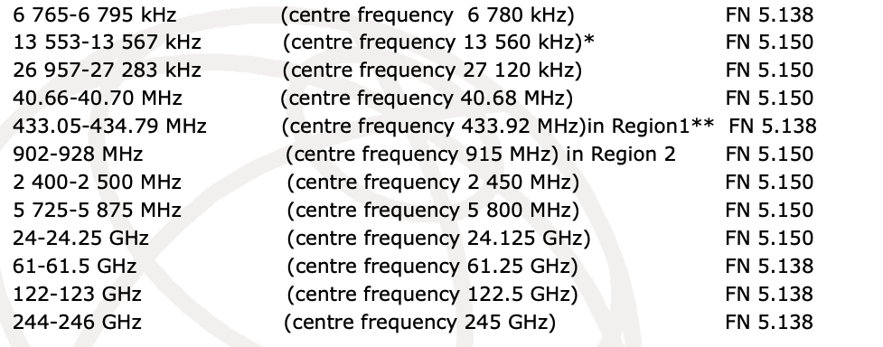
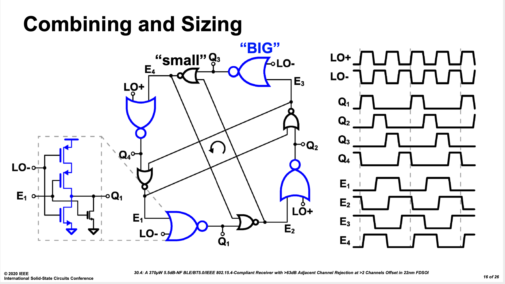
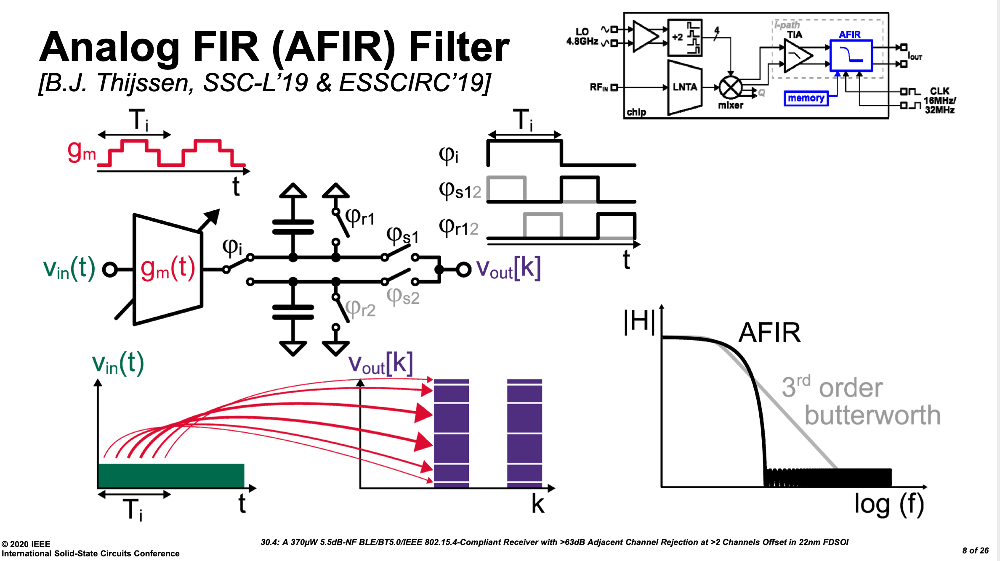
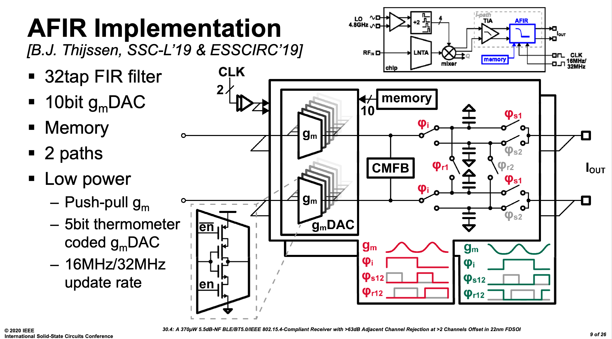
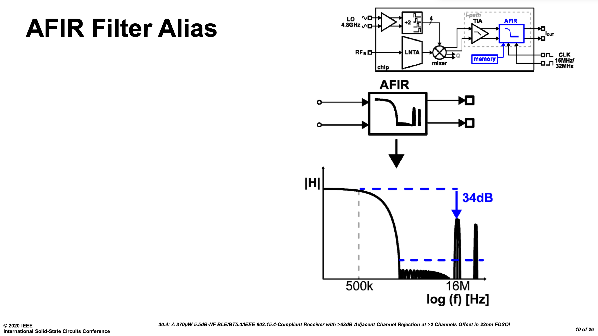
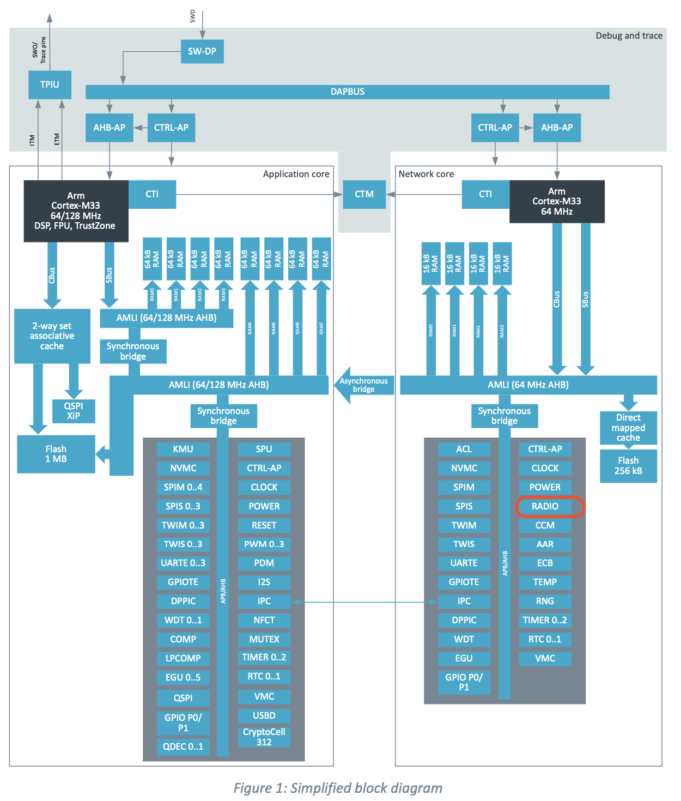

footer: Carsten Wulff 2021
slidenumbers:true
autoscale:true
theme:Plain Jane,1

# TFE4188 - Lecture 7
# Low Power Radios

---

| Week | Book                 | Monday                                                                       | Project plan             | Exercise |
|------|----------------------|------------------------------------------------------------------------------|--------------------------|----------|
| 2    | CJM 1-6              | Course intro, what I expect you to know, project, analog design fundamentals | Specification            |          |
| 3    | Slides               | ESD and IC Input/Output                                                      | Specification            | x        |
| 4    | CJM 7,8              | Reference and bias                                                           | Specification            |          |
| 5    | CJM 12               | Analog Front-end                                                             | M1. Specification review | x        |
| 6    | CJM 11-14            | Switched capacitor circuits                                                  | Design                   |          |
| 7    | JSSC, CJM 18         | State-of-the-art ADCs                                                 | Design                   | x        |
| 8    | Slides               | **Low power radio recievers**                                                    | Design                   |          |
| 9    | Slides               | Communication standards from circuit perspective                             | M2. Design review        | x        |
| 10   | CJM 7.4, CFAS,+DC/DC | Voltage regulation                                                           | Layout                   |          |
| 11   | CJM 19, CFAS         | Clock generation                                                             | M3. Layout review        | x        |
| 12   | Paper                | Energy sources                                                               | Layout/LPE simulation    |          |
| 13   | Slides               | Chip infrastructure                                                          | Layout/LPE simulation    | x        |
| 14   |                      | Tapeout review                                                               | M4. Tapeout review       |          |
| 15   |                      | Easter                                                                       |                          |          |
| 16   |                      | Easter                                                                       |                          |          |
| 17   |                      | Exam repetition                                                              |                          |          |

---

# Goal

Let's make a radio reciever (or at least, let's **pretend**)

Introduce tradeoff's for Low Power Recievers

---

#[fit] Our goal is to sell radio ICs for wireless keyboard and mice

---
# What do we need to know?
- Data Rate
- Carrier Frequency & Range
- Supply voltage

---
#[fit] Data Rate

---
# Data 
Assume mouse case limits data

| What | Bits | Why |
| ----  | ---- | ---- |
| X displacement | 8 | |
| Y displacement | 8 | |
| CRC | 4 | Bit errors|
| Buttons| 16 | On-hot coding. Most mice have buttons|
| Preamble| 8 | Syncronization|
| Address | 32 | Unique identifier |
| Total | 76 | |

---
# Rate
Assume gaming mouse limits rate.

Assume we must have one update every 1 ms

---
# Data Rate

Application Data Rate > 76 bits/ms = 76 kbps

Assume 30 % packet loss

Raw Data Rate > 228 kbps

Multiply by $$\pi$$ > 716 kbps

Round to nearest nice number = 1Mbps

----
# [fit] Carrier Frequency & Range
----
# ISM (industrial, scientific and medical) bands

---
# Antenna

[.column]
Assume $$\lambda/4$$ is an OK antenna size ($$\lambda = c/f$$)

[.column]
| ISM band |$$\lambda/4$$ | Unit|OK/NOK|
|---|---:|---:|---:|
| 40.68 MHz | 1.8  | m |:x:|
| 433.92 MHz | 17 | cm|:x:|
| 915 MHz | 8.2 | cm||
| 2450 MHz | 3.06 | cm|:white_check_mark:|
| 5800 MHz | 1.29 | cm|:white_check_mark:|
| 24.125 GHz | 3.1 | mm|:white_check_mark:|
| 61.25 GHz | 1.2 | mm|:white_check_mark:|
---
# Range (Friis)
[.column]

Assume no antenna gain, power density p at distance D is

$$ p = \frac{P_{TX}}{4 \pi D^2}$$

Assume reciever antenna has no gain, then the effective apature is

$$ A_e = \frac{\lambda^2}{4 \pi}$$

[.column]

Power recieved is then

$$P_{RX} = \frac{P_{TX}}{D^2} \left[\frac{\lambda}{4 \pi}\right]^2$$

Or in terms of distance

$$ D = 10^\frac{P_{TX} - P_{RX} + 20 log_{10}\left(\frac{c}{4 \pi f}\right)}{20} $$

---

#Range (Free space)

Assume TX = 0 dBm, assume RX sensitivity is -80 dBm

| Freq | **$$20 log_{10}\left(c/4 \pi f\right)$$** [dB]| D [m]| OK/NOK|
| ----|:----:| ---: | ---:|
| 915M | -31.7 | 260.9 | :white_check_mark:|
| **2.45G** | **-40.2** | **97.4** |:white_check_mark:|
| 5.80G | -47.7 | 41.2 |:white_check_mark:|
| 24.12G | -60.1 | 9.9 | :x:|
| 61.25G | -68.2 | 3.9 | :x:|

----
# [fit] Supply voltage
----

# Battery voltage

Keyboard and mouse is likely 2 x AA, 1 x AA or coin cell

|Cell |Chemistry|  Voltage |
|----|:----|----:|
| AA |LiFeS2  | 1.0 - 1.8 |
| 2xAA |LiFeS2  | 2.0 - 3.6 |
| AA |Zn/Alk/MnO2 | 0.8 - 1.6 |
| 2xAA |Zn/Alk/MnO2 | 1.6 - 3.2 |
| Coin | LiMnO2 | 2.0 - 3.3 |
| **Total** | | **0.8 - 3.6** |

---

# Modulation scheme

| Scheme | Acronym|Pro | Con |
| ----| ----|----| ----|
| Binary phase shift keying | BPSK | Simple | Not constant envelope|
| Quadrature phase-shift keying | QPSK |2bits/symbol| Not constant envelope|
| Offset QPSK |OQPSK| 2bits/symbol | Constant envelope with half-sine pulse shaping|
| Gaussian Frequency Shift Keying | GFSK | 1 bit/symbol| Constant envelope|
| Quadrature amplitude modulation| QAM | > 1024 bits/symbol| Really non-constant envelope|
---
# Single carrier, or multi carrier?

Bluetooth, 802.15.4, ANT all use one carrier
- Simple TX, constant envelope

WiFi, LTE ++ all use Ortogonal frequency division multiplexing (OFDM)
- Complex TX, non-constant envelope

---
#[fit] Let's make the best, highest data rate radio!

---
# Wifi 6 (802.11ax)
[An 802.11ax 4 × 4 High-Efficiency WLAN AP Transceiver SoC Supporting 1024-QAM With Frequency-Dependent IQ Calibration and Integrated Interference Analyzer](https://ieeexplore.ieee.org/document/8528383)

---
 

---

---

---

# [fit] Crap, complex!
# [fit] Crap, too high power!

---

# [fit] Assumption is the ancestor of all mistakes!

---

#[fit] Low Power Recievers

---
# Algorithm to design state-of-the-art BLE radio
- Find most recent digest from International Solid State Circuit Conference (ISSCC)
- Find BLE papers (i.e 2020 Efficient Wireless Connectivity session)
- Pick the best blocks from each paper

---

---

|Blocks| Key parameter | Architecture| Complexity (nr people)|
|---|---|---| ---|
| Antenna | Gain, impedance| ?? | <1 |
| RF match| loss, input impedance| PI-match? | <1 |
| Low noise amp | NF, current, linearity| LNTA| 1 |
| Mixer | NF, current, linearity| Passive | 1	|
| Anti-alias filter| NF, linearity| TIA + AFIR| 1|
| ADC | Sample rate, dynamic range, linearity| NS-SAR| 1 - 2| 
| PLL | Freq accuracy, phase noise, current| AD-PLL | 2-3 |
| Baseband | Eb/N0, gate count, current| Verilog, but first Matlab | > 10|

---

# [fit] LNTA

---

---

---

---

# [fit] MIXER

---

---

---

# [fit] AAF

---

---

---

---

---

# [fit] ADC

---

---

---

---

---

# [fit] AD-PLL

---
#Phase Locked loops

[.column]

[.column]
- Read Razavi's PLL book [^7]
- Read Cole's project report [^6]

---
AD-PLL with Bang-Bang phase detector for steady-state [^5]

---

#[fit] Baseband

---

|Baseband block | Why |
|---|---|
| Mixer? | If we're using low intermediate frequency to avoid DC offset problems and flicker noise|
| Channel filters?| If the AAF is insufficient for adjaecent channel|
| Power detection | To be able to control the gain of the radio|
| Phase extraction| Assuming we're using FSK|
| Timing recovery | Figure out when to slice the symbol|
| Bit detection | single slice, multi-bit slice, correlators etc, see|
| Address detection | Is the packet for us?|
| Header detection | What does the packet contain|
| CRC  | Does the packet have bit errors|
| Payload decrypt| Most links are encrypted by AES|
| Memory access| Payload need to be stored until CPU can do something|

---

# What do we really want, in the end?

$$P_{RX_{sens}} = -174 dBm + 10 \times log10(DR)  + NF + Eb/N0$$

for example, for nRF5340 

$$ P_{RX_{sens}} + 174 - 60 =  NF + Eb/N0 = 17 dB$$

---

---

---

#carstenw@ntnu.no

#carsten.wulff@nordicsemi.no

#carsten@wulff.no

[^1]: "A 0.5V BLE Transceiver with a 1.9mW RX Achieving -96.4dBm Sensitivity and 4.1dB Adjacent Channel Rejection at 1MHz Offset in 22nm FDSOI", M. Tamura, Sony Semiconductor Solutions, Atsugi, Japan, 30.5, ISSCC 2020

[^2]: "A 370μW 5.5dB-NF BLE/BT5.0/IEEE 802.15.4-Compliant Receiver with >63dB Adjacent Channel Rejection at >2 Channels Offset in 22nm FDSOI", B. J. Thijssen, University of Twente, Enschede, The Netherlands

[^3]: "A 68 dB SNDR Compiled Noise-Shaping SAR ADC With On-Chip CDAC Calibration", H. Garvik, C. Wulff, T. Ytterdal

[^4]: "A Compiled 9-bit 20-MS/s 3.5-fJ/conv.step SAR ADC in 28-nm FDSOI for Bluetooth Low Energy Recievers", C. Wulff, T. Ytterdal

[^5]: Cole Nielsen, https://github.com/nielscol/thesis_presentations

[^6]: "Python Framework for Design and Simulation of Integer-N ADPLLs", Cole Nielsen, https://github.com/nielscol/tfe4580-report/blob/master/report.pdf

[^7]: Design of CMOS Phase-Locked Loops, Behzad Razavi, University of California, Los Angeles

