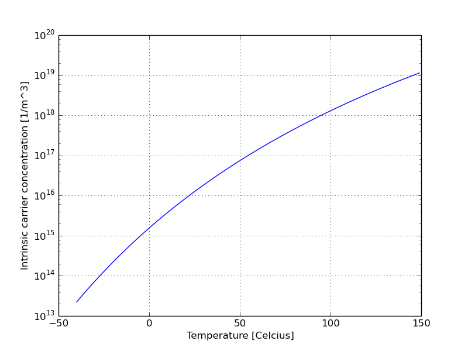
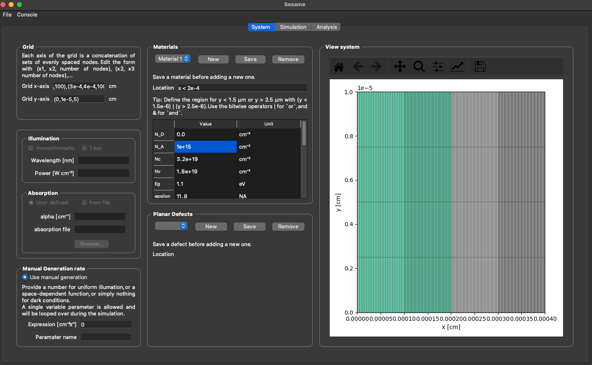
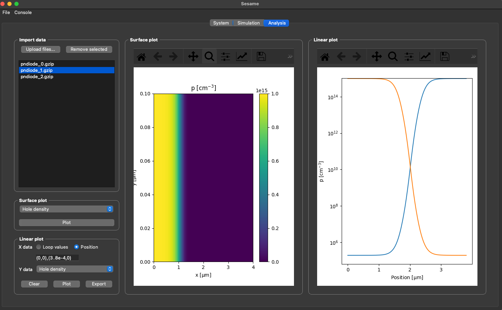
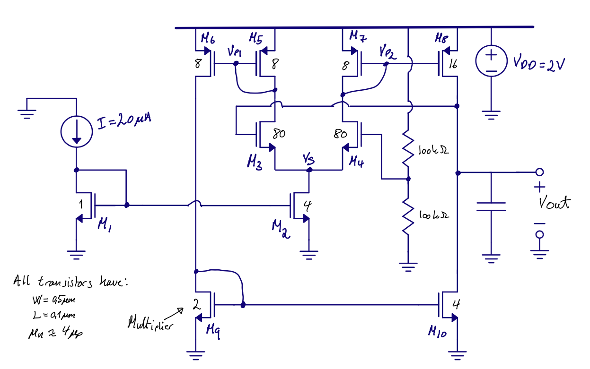
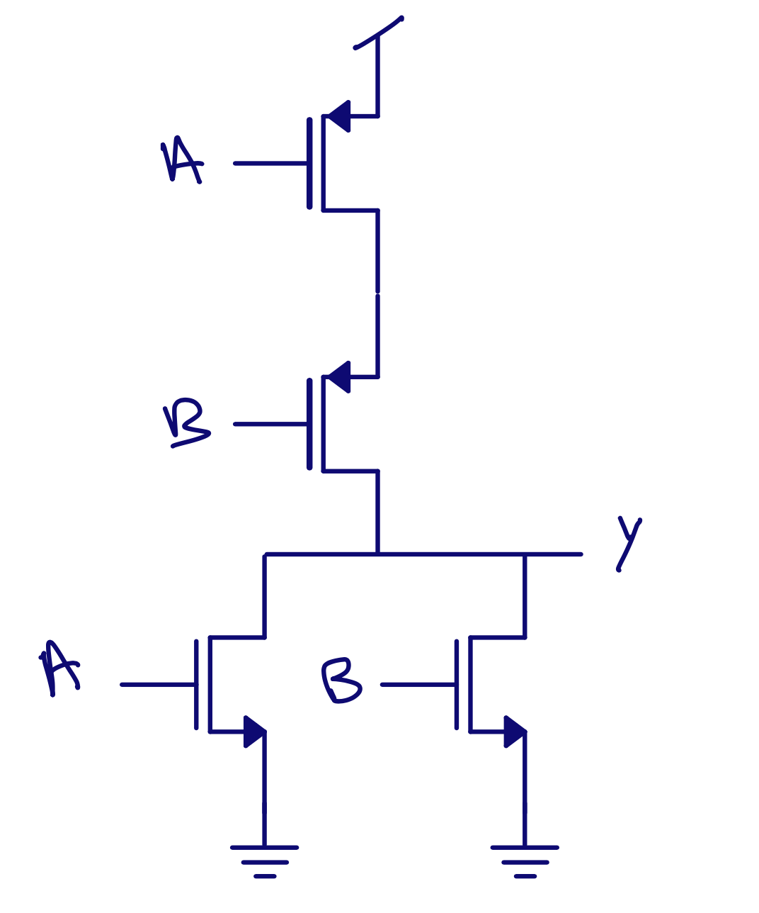
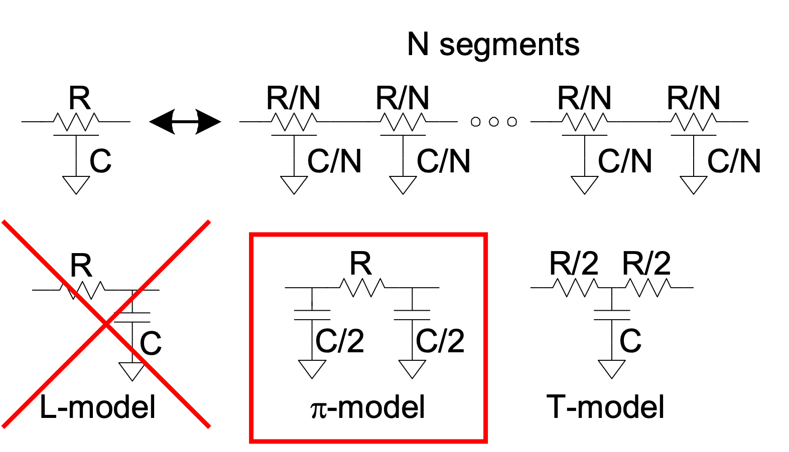
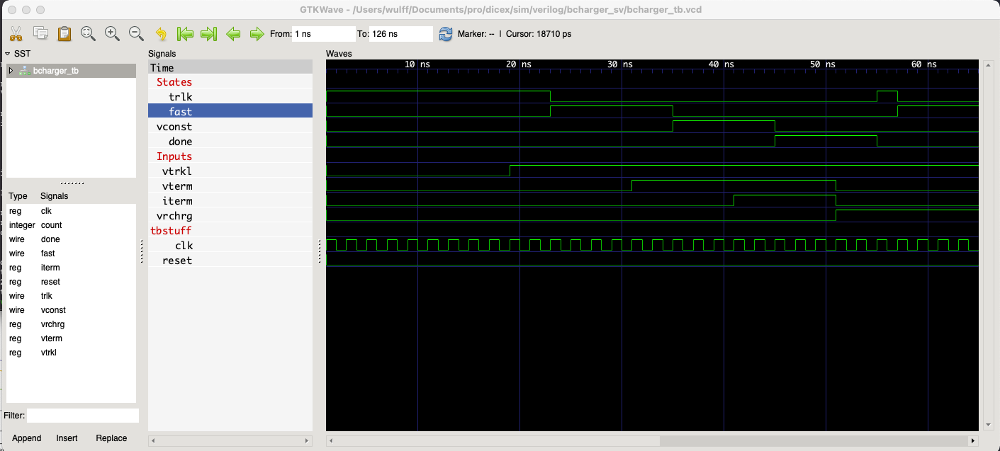

footer: Carsten Wulff 2022
slidenumbers:true
autoscale:true
theme: Plain Jane, 1
text:  Helvetica
header:  Helvetica

## TFE4188 - Lecture 1
# What I expect you to know

## [Source](https://github.com/wulffern/aic2022/blob/main/lectures/l1_need_to_know.md)

---

#[fit] Quantum Mechanics

---
# Want to go deeper on the physics

[Feynman lectures on physics](https://www.feynmanlectures.caltech.edu)

[MIT 8.04 Quantum Mechanics I](https://ocw.mit.edu/courses/physics/8-04-quantum-physics-i-spring-2013/lecture-videos/)

[MIT 8.05 Quantum Mechanics II](https://ocw.mit.edu/courses/physics/8-04-quantum-physics-i-spring-2013/lecture-videos/)

---


---

## Classical equations
Kinetic energy + potential energy = Total Energy

$$\frac{1}{2 m} p^2 + V = E$$ 
 
where $$ p = m v $$, $$m$$ is the mass, $$v$$ is the velocity and $$V$$ is the potential

---

## Quantum mechanical

State of a fermion is fully described by the probability amplitude $$\psi(x,t)$$, also called the wave function of a particle.

The total energy of a particle is described by the Schrodinger Equation

$$ \frac{1}{2 m} \frac{\hbar}{j^2} \frac{\partial^2}{\partial^2 x}\psi(x,t) + V(x)\psi(x,t) = -\frac{\hbar}{j}\frac{\partial}{\partial t} \psi(x,t)$$

---
## Quantum mechanics key concepts

To determine the moment or energy of multiple particles, you cannot consider them discrete entities. For example, the probabilty of finding a free electron in a particular location is given by
$$P_1(x) = \int_{x_1}^{x_2}  |\psi_1(x,0)|^2$$, where $$P_1 = \int_{-\infty}^{\infty} |\psi_1(x,0)| = 1$$

However, if we have two electrons, described by $$\psi_1(x,0)$$ and $$\psi_2(x,0)$$, then  $$P_{12}(x) \ne P_1(x) + P_2(x)$$, but rather $$P_{12}(x) = \int_{x_1}^{x_2} |\psi_1(x,0) + \psi_2(x,0)|^2$$

It is the probability amplitudes that add, not the probabilities. And to make things more interesting, one solution to the Schrodinger equation is $$\psi(x,t) = Ae^{j(kx - \omega t)}$$, where $$k$$ is the wave number, and the $$\omega$$ is the angular frequency. This is a complex function of position and time!

---
# Silicon crystal

[.column]
A pure silicon crystal can be visualized by a smallest repetable unit cell.

The unit cell is a face-centered cubic crystal with a lattice spacing of approx $$a = 5.43$$Å

- 8 corner atoms
- 6 face atoms
- 4 additional atoms spaced at 1/4 lattice spacing from 3 face atoms and 1 corner atom  

Nearest neighbor $$d = \frac{1}{2}\left(a \sqrt{2}\right)$$

[.column]


---
## Energy levels of electrons in solids (current)

Electrons can only exist in discrete energy levels, given by the solutions to the Schrodinger equation.
Since the probability amplitudes add for electrons in close proximity, then for crystals it's more complicated. 


---
## Movement of electrons in solids

Electrons in solids can move if there are allowed energy states they can occupy.

In a semiconductor the valence band and first conduction band is separated by a band-gap (in conductors the bands overlap)

There are two options in semiconductors

- The valence band is not filled (holes), so electrons can move
- The electrons are given sufficient energy to reach conduction band, and are "free" to move

---
# Silicon crystal facts

Although we know to an exterme precision exactly how electrons behave (Schrodinger equation). It is insainly complicated to compute the movement of electrons in a real silicon crystal with the Shrodinger equation.

Most "facts" about silicon crystal, like bandgap, effective mass, and mobility of electrons (or holes) are emprically determined.

In other words, we make assumptions, and grossly oversimplify, in order to handle complexity.

---

#[fit] PN Junctions

---
$$ 
q = 1.6 \times 10^{-19} [C] 
$$ 
$$ 
k = 1.38 \times 10^{-23} [J/K] 
$$

$$ 
\mu_0 = \frac{2 \alpha}{q^2}\frac{h}{c}  = 1.26 \times 10^{-6} [H/m] 
$$

$$ 
\epsilon_0 = \frac{1}{\mu_0 c^2} = 8.854 \times 10^{-12} [F/m]  
$$ 

where q is unit charge, k is Boltzmann's constant,  h is Plancks constant, c is speed of light and alpha is the fine structure constant

---

# Computer models

[http://bsim.berkeley.edu/models/bsim4/](http://bsim.berkeley.edu/models/bsim4/)

[http://bsim.berkeley.edu/BSIM4/BSIM480.zip](http://bsim.berkeley.edu/BSIM4/BSIM480.zip)


---

$$ n_i \approx 1 \times 10^{16} [1/m^3]  = 1 \times 10^{10} [1/cm^3]$$ at 300 K

$$ n_i^2 = n_0 p_0 $$

$$ n_i = \sqrt{N_C N_V}e^{\frac{-E_g}{2kT}} $$

$$ N_C = 2\left(\frac{2 \pi m_{n}^* k T}{h^2}\right)^{3/2} $$
$$ N_V = 2\left(\frac{2 \pi m_{p}^* k T}{h^2}\right)^{3/2} $$


[https://github.com/wulffern/dic2021/blob/main/2021-07-08_diodes/intrinsic.py](https://github.com/wulffern/dic2021/blob/main/2021-07-08_diodes/intrinsic.py)



---

Solid state physics: 

$$ n_i = \sqrt{N_C N_V}e^{\frac{-E_g}{2kT}} $$

BSIM 4.8, Intrinsic carrier concentration (page 122)

$$
n_i = 1.45e10\frac{TNOM}{300.15}\sqrt{\frac{T}{300.15}}exp\left[21.5565981 - \frac{qE_g(TNOM)}{2 k_b T}\right]
$$

---


---


---

[.column]

# Built in voltage

Comes from Fermi-Dirac statistics

$$ \frac{n_n}{n_p} = \frac{e^{(E_{p} - \mu) / kT} + 1}{e^{(E_{n} - \mu) /
kT} + 1}  \approx  e^{\frac{q \Phi_0}{kT}} $$

where $$ q \Phi_0 $$ is the energy ($$E_{p} - E_{n}$$) required to climb the potential barrier, $$
kT $$ is the thermal energy, $$\mu$$ is the total chemical potential and $$n_n$$ and $$n_p$$ are the electron concentrations in the n-type and p-type.

[.column]

$$\Phi_0 = V_T ln\left(\frac{N_A N_D}{n_i^2}\right)$$

$$ V_T = \frac{kT}{q}$$

---

#[fit] $$ I_{diode} = I_s (e^{V_D/V_T} -1) $$

---

#[fit] Sesame 

---

Sesame is a Python3 package for solving the drift diffusion Poisson equations for multi-dimensional systems using finite differences.

[Install instructions](https://sesame.readthedocs.io/en/latest/pre/INSTALL_beginner.html)


<sub>Semiconductor current-flow equations (diffusion and degeneracy), R.Stratton,
IEEE Transactions on Electron Devices
[https://ieeexplore.ieee.org/document/1477063](https://ieeexplore.ieee.org/document/1477063)</sub>


---



---


---



---

#[fit] Mosfets

---

[.column]

NMOS conduct for positive gate-to-source voltage


[.column]

PMOS conduct for negative gate-to-source voltage


---


---

# Drain Source Current ($$I_{DS}$$)

### dicex/sim/spice/NCHIO

---
# Large signal model

## $$I_{DS} = f(V_{GS},V_{DS},...)$$


---

#[fit] Gate Source Voltage ($$V_{GS}$$)

---

# Gate-source voltage

| Param | Voltage [V]|
| :---:| :---:|
| V<sub>GS</sub> | 0 to 1.8 |
| V<sub>DS</sub> | 1.0 |
| V<sub>S</sub> | 0 |
| V<sub>B</sub> | 0 |

$$i(vcur) = I_{DS} $$


---
# Inversion level

Define $$ V_{eff} \equiv V_{GS} - V_{tn} $$, where $$V_{tn}$$ is the "threshold voltage" 

| V<sub>eff</sub>  | Inversion level |
| :---:  | :---: |
| < 0  | weak inversion or subthreshold |
|  0    | moderate inversion |
| > 100 mV | strong inversion| 


---

# Weak inversion
 
The drain current is low, but not zero, when $$ V_{eff} << 0$$

$$
I_{DS} \approx I_{D0} \frac{W}{L} e^{V_{eff}/n V_{T}} \text{  if } V_{DS} > 3 V_{T} 
$$

$$
n \approx 1.5
$$


---
# Moderate inversion

Very useful region in real designs. Hard for hand-calculation. Trust the model.


---

# Strong inversion
 
$$
I_{DS} = \mu_n C_{ox} \frac{W}{L} 
\begin{cases}
V_{eff} V_{DS} & \text{if }V_{DS} << V_{eff} \\[15pt]
V_{eff} V_{DS} - V_{DS}^2/2
& \text{if }  V_{DS} < V_{eff}  \\[15pt]
\frac{1}{2} V_{eff}^2
& \text{if }  V_{DS} > V_{eff} \\[15pt]
\end{cases}
$$


---


---


---


---


---

# The threshold voltage ($$ V_{tn} $$) is defined as $$ p_p = n_{ch} $$ 

---

# Drain-source voltage

| Param | Voltage [V]|
| :---:| :---:|
| V<sub>GS</sub> | 0.5 |
| V<sub>DS</sub> | 0 to 1.8 |
| V<sub>S</sub> | 0 |
| V<sub>B</sub> | 0 |

$$i(vcur) = I_{DS} $$


---

# Strong inversion
 
$$
I_{DS} = \mu_n C_{ox} \frac{W}{L} 
\begin{cases}
V_{eff} V_{DS} & \text{if }V_{DS} << V_{eff} \\[15pt]
V_{eff} V_{DS} - V_{DS}^2/2
& \text{if }  V_{DS} < V_{eff}  \\[15pt]
\frac{1}{2} V_{eff}^2
& \text{if }  V_{DS} > V_{eff} \\[15pt]
\end{cases}
$$


---


---


---


---


---

#[fit] Low frequency model

---

## $$ g_{m} = \frac{\partial I_{DS}}{\partial V_{GS}}\ $$

## $$ g_{ds} = \frac{1}{r_{ds}}  = \frac{\partial I_{DS}}{\partial V_{DS}}\ $$


---
## Transconductance ($$ g_m $$)
[.column]

Define $$ \ell = \mu_n C_{ox} \frac{W}{L} $$ and $$ V_{eff} = V_{GS} - V_{tn} $$ 

 $$ I_{D} = \frac{1}{2} \ell (V_{eff})^2$$ and $$ V_{eff} = \sqrt{\frac{2I_{D}}{\ell}} $$ and $$ \ell = \frac{2I_D}{V_{eff}^2} $$

 $$ g_m = \frac{ \partial I_{DS}} {\partial V_{GS}} = \ell V_{eff} = \sqrt{2 \ell I_{D}} $$
 
 $$  g_m = \ell V_{eff} = 2 \frac{I_D}{V_{eff}^2} V_{eff} = \frac{2 I_D}{V_{eff}} $$

[.column]
---

Define $$ \ell = \mu_n C_{ox} \frac{W}{L} $$ and $$ V_{eff} = V_{GS} - V_{tn} $$ 

 $$ I_D = \frac{1}{2} \ell V_{eff}^2[1 + \lambda V_{DS} - \lambda V_{eff})] $$ 

 $$\frac{1}{r_{ds}} = g_{ds} = \frac{ \partial I_D}{\partial V_{DS} }  = \lambda \frac{1}{2} \ell V_{eff}^2$$
 
 Assume channel length modulation is not there, then 
 
 $$I_D = \frac{1}{2} \ell V_{eff}^2 $$ which means $$\frac{1}{r_{ds}} = g_{ds} \approx \lambda I_D $$

---

# Intrinsic gain

Define intrinsic gain as  

 $$ A = \left|\frac{v_{out}}{v_{in}}\right| =  g_m r_{ds} = \frac{g_m}{g_{ds}}  $$

 $$ A  =  \frac{2 I_D}{V_{eff}} \times \frac{1}{ \lambda I_D } = \frac{2}{\lambda V_{eff}}  $$


<sub>vgaini = Gate Source Voltage = $$V_{eff} + V_{tn} $$ </sub>

---


---

#[fit] High frequency model

---


 

---


---
# $$C_{gs} $$ and $$C_{gd}$$

[.column]

$$
C_{gs} =
\begin{cases}
WLC_{ox} & \text{if }V_{DS} = 0 \\[15pt]
\frac{2}{3}WLC_{ox} & \text{if }V_{DS} > V_{eff} \\[15pt]
\end{cases}
$$

[.column]

$$ C_{gd} = C_{ox} W L_{ov} $$

---

# $$C_{sb}$$ and $$C_{db}$$

Both are depletion capacitances

[.column]
$$ C_{sb} = (A_s + A_{ch}) C_{js} $$

$$ C_{js} = \frac{C_{j0}}{\sqrt{1 + \frac{V_{SB}}{\Phi_0}}} $$

$$\Phi_0 = V_T ln\left(\frac{N_A N_D}{n_i^2}\right)$$

[.column]

$$ C_{db} = A_d C_{jd} $$

$$ C_{js} = \frac{C_{j0}}{\sqrt{1 + \frac{V_{DB}}{\Phi_0}}} $$

---

### Be careful with $$ C_{gd} $$ (blame Miller)

[.column]

If $$ Y(s) = 1/sC $$ then 
 $$Y_1(s) = 1/sC_{in} $$ and $$Y_2(s) = 1/sC_{out}$$ where
 $$ C_{in} = (1 + A) C $$, $$ C_{out} = (1 + \frac{1}{2})C $$
 
 $$ C_{1} = C_{gd} g_{m} r_{ds} $$

**$$C_{gd}$$ can appear to be 10 to 100 times larger!**

 if gain from input to output is large 


[.column]


---

#[fit] Weak inversion 
# <sub> or subthreshold </sub>

---

If $$ V_{eff} < 0 $$ diffusion currents dominate.

 $$ I_{D} = I_{D0} \frac{W}{L} e^{V_eff / n V_T} $$, where
 
 $$ V_T = kT/q $$, $$n = (C_{ox} + C_{j0})/C_{ox}$$
 
 $$ I_{D0} = (n - 1) \mu_n C_{ox} V_T^2 $$

 $$ g_m = \frac{I_D}{nV_T} $$


---
# $$ g_m/I_D $$ <sub> or "bang for the buck" </sub>

 Subthreshold:  
 
 $$ \frac{g_m}{I_D} = \frac{1}{nV_T} \approx 25.6 \text{ [S/A] @ 300 K} $$ 

 Strong inversion:  
 
 $$ \frac{g_m}{I_D} = \frac{2}{V_{eff}}$$ 


---

#[fit] Velocity saturation

---

[.column]

Electron speed limit in silicon

 $$ v \approx  10^7 cm/s $$

 $$ v = \mu_n E = \mu_n \frac{dV}{dx} $$
 
 $$ \mu_n \approx 100 \text{ to  } 600 \text{  } cm^2/Vs $$ in nanoscale CMOS
 
[.column]
 


---

[.column]

## Square law model

 $$ Q(x) = C_{ox}\left[V_{eff} - V(x)\right] $$ 
 
 $$ v = \mu_n E = \mu_n \frac{dV}{dx} $$ 
 
 $$ \ell = \mu_n C_{ox} \frac{W}{L} $$

 $$ I_{D} = W Q(x) v  = \ell L \left[ V_{eff} - V(x)\right] \frac{dV}{dx} $$

 $$ I_{D} dx = \ell L \left[ V_{eff} - V(x)\right] dV $$

[.column]

 $$ I_{D} \int_0^L{dx}  = \ell L \int_0^{V_{DS}}{\left[ V_{eff} - V(x)\right] dV} $$

 $$ I_{D} \left[x\right]_0^L = \ell L \left[V_{eff}V - \frac{1}{2}V^2\right]_0^{V_{DS}} $$

 $$ I_{D} L = \ell L \left[V_{eff}V_{DS} - \frac{1}{2} V_{DS}^2\right] $$

 $$ @ V_{DS} = V_{eff} \Rightarrow I_{D} = \frac{1}{2} \ell V_{eff}^2 $$

---

 
[.column]
 
## Mobility Degredation

Multiple effects degrade mobility

- Velocity saturation
- Vertical fields reduce channel depth => more charge-carrier scattering

 $$ \ell = \mu_n C_{ox} \frac{W}{L} $$

[.column]
 

 $$ \mu_{n\_eff} = \frac{\mu_n}{([1 + (\theta V_{eff})^m])^{1/m}} $$

 $$ I_{D} = \frac{1}{2} \ell V_{eff}^2 \frac{1}{([1 + (\theta V_{eff})^m])^{1/m}} $$

From square law
$$ g_{m} = \frac{\partial I_{D}}{\partial V_{GS}} =   \ell V_{eff} $$

With mobility degredation
$$ g_{m(mob-deg)} = \frac{\ell}{2 \theta} $$

---

#[fit] What about holes (PMOS)

---

[.column]

In PMOS holes are the charge-carrier (electron movement in valence band)

 $$ \mu_p < \mu_n $$

In intrinsic silicon:
 $$ \mu_n  \leq 1400 [cm^2/Vs] = 0.14 [m^2/Vs] $$
 $$ \mu_p  \leq 450 [cm^2/Vs] = 0.045 [m^2/Vs] $$
 
 $$ \mu_n \approx 3\mu_p $$

[.column]

 $$ v_{n\_max} \approx 2.3 \times 10^5 [m/s] $$
 $$ v_{p\_max} \approx 1.6 \times 10^5 [m/s] $$


 **Doping ($$N_A \text{or} N_D$$) reduces $$\mu $$** 

---

#[fit] OTHER

---

# As we make transistors smaller, we find new effects that matter, and that must be modelled.

### <sub> which is an opportunity for engineers to come up with cool names </sub>

---


[https://ieeexplore.ieee.org/document/5247174](https://ieeexplore.ieee.org/document/5247174 )

---


---

#[fit] Drain induced barrier lowering (DIBL)

---


---

#[fit] Well Proximity Effect (WPE)

---


---

#[fit] Stress effects 

---

| Stress | PMOS | NMOS |
| :--: | :--: | :---:|
| Stretch Fz | Good | Good |
| Compress Fy | OK | Good |
| Compress Fx | Good | Bad |

## What can change stress?


---


#[fit] Gate current

---


---

#[fit] Hot carrier injection

---


---

#[fit] Channel initiated secondary-electron (CHISEL)

---


---

#[fit] Variability

---

#[fit] Provide $$I_2 = 1 \mu A $$ 

Let's use off-chip resistor $$R$$, and pick $$R$$ such that $$I_1 = 1 \mu A $$

Use $$ \frac{W_1}{L_1} = \frac{W_2}{L_2} $$ 

**What makes $$ I_2 \ne 1 \mu A $$?**


---

## Voltage variation

## Systematic variations

## Process variations

## Temperature variation

## Random variations

## Noise


---
#[fit] Voltage variation

 $$I_1 = \frac{V_{DD} - V_{GS1}}{R}$$


If $$V_{DD}$$ changes, then current changes.

**Fix**: Keep $$V_{DD}$$ constant


---


# Systematic variations

If $$ V_{DS1} \ne V_{DS2} \rightarrow I_1 \ne I_2 $$

If layout direction of $$ M_1 \ne M_2 \rightarrow I_1 \ne I_2 $$ 

If current direction of $$ M_1 \ne M_2 \rightarrow I_1 \ne I_2 $$

If $$ V_{S1} \ne V_{S2} \rightarrow I_1 \ne I_2 $$

If $$ V_{B1} \ne V_{B2} \rightarrow I_1 \ne I_2 $$

If $$ WPE_{1} \ne WPE_{2} \rightarrow I_1 \ne I_2 $$

If $$ Stress_{1} \ne Stress_{2} \rightarrow I_1 \ne I_2 $$
...


---
# Process variations

Assume strong inversion and active **$$ V_{eff} = \sqrt{\frac{2}{\mu_p C_{ox} \frac{W}{L}} I_1} $$**, $$V_{GS} = V_{eff} + V_{tp}$$

 $$ I_1 = \frac{V_{DD} - V_{GS}}{R} =  \frac{V_{DD} - \sqrt{\frac{2}{\mu_p C_{ox} \frac{W}{L}} I_1}  - V_{tp}}{R} $$ 

 $$\mu_p$$, $$C_{ox}$$, $$V_{tp}$$ will all vary from die to die, and wafer lot to wafer lot.


---
# Process corners

Common to use 5 corners, or [Monte-Carlo](https://en.wikipedia.org/wiki/Monte_Carlo_method) process simulation

| Corner | NMOS | PMOS |
| :---: | :---: | :---: | 
| Mtt | Typical | Typical|
| Mss | Slow | Slow|
| Mff | Fast | Fast |
| Msf | Slowish | Fastish |
| Mfs | Fastish | Slowish |


---
# Fix process variation

Use calibration: measure error, tune circuit to fix error

For every single chip, measure voltage across known resistor $$R_1$$ and tune $$R_{var}$$ such that we get $$I_1 = 1 \mu A$$

Be careful with multimeters, they have finite input resistance (approximately 1 M$$\Omega$$)


---

# Temperature variation

Mobility decreases with temperature

Threshold voltage decreases with temperature.

$$ I_D = \frac{1}{2}\mu_n C_{ox} (V_{GS} - V_{tn})^2$$

High $$I_D = $$ fast digital circuits

Low $$I_D = $$ slow digital circuits 

**What is fast? High temperature or low temperature?**


---
# It depends on $$V_{DD}$$

**Fast corner**
- Mff (high mobility, low threshold voltage) 
- High $$V_{DD}$$ 
- High or low temperature


**Slow corner**
- Mss (low mobility, high threshold voltage)
- Low $$V_{DD}$$ 
- High or low temperature


---
# How do we fix temperature variation?

Accept it, or don't use this circuit.

If you need stability over temperature, use 7.3.2 and 7.3.4 in CJM (SUN\_BIAS\_GF130N)
 


---

#[fit] Random Variation

---
[.background-color: #000000]
[.text: #FFFFFF]

[.column]

[Mean](https://en.wikipedia.org/wiki/Mean)
$$ \overline{x(t)} = \lim_{T\to\infty} \frac{1}{T}\int^{+T/2}_{-T/2}{ x(t) dt} $$

Mean Square
$$ \overline{x^2(t)} = \lim_{T\to\infty} \frac{1}{T}\int^{+T/2}_{-T/2}{ x^2(t) dt} $$

[Variance](https://en.wikipedia.org/wiki/Variance)
$$ \sigma^2 = \overline{x^2(t)} - \overline{x(t)}^2$$

where $$\sigma$$ is the standard deviation.
If mean is removed, or is zero, then
$$ \sigma^2 = \overline{x^2(t)} $$

[.column]
Assume two random processes, $$x_1(t)$$ and $$x_2(t)$$ with mean of zero (or removed).
 $$ x_{tot}(t) =  x_1(t) + x_2(t)$$
 $$ x_{tot}^2(t) = x_1^2(t) + x_2^2(t) + 2x_1(t)x_2(t)$$

Variance (assuming mean of zero) 
$$ \sigma^2_{tot} = \lim_{T\to\infty} \frac{1}{T}\int^{+T/2}_{-T/2}{ x_{tot}^2(t) dt} $$
$$ \sigma^2_{tot} = \sigma_1^2 + \sigma_2^2 + \lim_{T\to\infty} \frac{1}{T}\int^{+T/2}_{-T/2}{ 2x_1(t)x_2(t) dt} $$

**Assuming uncorrelated processes (covariance is zero), then
$$ \sigma^2_{tot} = \sigma_1^2 + \sigma_2^2  $$**

---

 $$\ell =  \mu_p C_{ox} \frac{W}{L}$$
 $$ I_D = \frac{1}{2} \ell (V_{GS} - V_{tp})^2$$
 
 Due to doping , length, width, $$C_{ox}$$, $$V_{tp}$$, ... random varation
 
 $$\ell_1 \ne \ell_2$$
 
 $$V_{tp1} \ne V_{tp2} $$

As a result $$ I_1 \ne I_2 $$, but we can make them close.

---
# Pelgrom's[^1] law

Given a random gaussian process parameter $$\Delta P$$ with zero mean, the variance is given by 

$$\sigma^2 (\Delta P) = \frac{A^2_P}{WL} + S_{P}^2 D^2$$

where $$A_P$$ and $$S_P$$ are measured, and $$D$$ is the distance between devices

Assume closely spaced devices ($$ D \approx 0$$) $$ \Rightarrow \sigma^2 (\Delta P) = \frac{A^2_P}{WL} $$


[^1]: M. J. M. Pelgrom, C. J. Duinmaijer, and A. P. G. Welbers, “Matching properties of MOS transistors,” IEEE J. Solid-State Cir- cuits, vol. 24, no. 5, pp. 1433–1440, Oct. 1989.
 
---

# Transistors with same $$V_{GS}$$[^2]

$$\frac{\sigma_{I_D}^2}{I_D^2} = \frac{1}{WL}\left[\left(\frac{gm}{I_D}\right)^2 \sigma_{vt}^2 + \frac{\sigma_{\ell}^2}{\ell}\right] $$

Valid in  weak, moderate and strong inversion


[^2]: Peter Kinget, see CJM

---


$$\frac{\sigma_{I_D}^2}{I_D^2} = \frac{1}{WL}\left[\left(\frac{gm}{I_D}\right)^2 \sigma_{vt}^2 + \frac{\sigma_{\ell}^2}{\ell}\right] $$
$$\frac{\sigma_{I_D}}{I_D} \propto \frac{1}{\sqrt{WL}}$$

Assume $$\frac{\sigma_{I_D}}{I_D} = 10\%$$, We want $$5\%$$, how much do we need to change WL?


$$\frac{\frac{\sigma_{I_D}}{I_D}}{2} \propto \frac{1}{2\sqrt{WL}} =  \frac{1}{\sqrt{4WL}}$$


**We must quadruple the area to half the standard deviation**

$$1 \%$$ would require **100** times the area


---

# What else can we do?

$$\frac{\sigma_{I_D}^2}{I_D^2} = \frac{1}{WL}\left[\left(\frac{gm}{I_D}\right)^2 \sigma_{vt}^2 + \frac{\sigma_{\ell}^2}{\ell}\right] $$

Strong inversion $$\Rightarrow \frac{gm}{I_D} = \frac{1}{2 V_{eff}} = low$$

Weak inversion $$\Rightarrow \frac{gm}{I_D} = \frac{q}{n k T} \approx 25$$

**Current mirrors achieve best matching in strong inversion**


---

$$\frac{\sigma_{I_D}^2}{I_D^2} = \frac{1}{WL}\left[\left(\frac{gm}{I_D}\right)^2 \sigma_{vt}^2 + \frac{\sigma_{\ell}^2}{\ell}\right] $$

$$\sigma_{I_D}^2 = \frac{1}{WL}\left[gm^2 \sigma_{vt}^2 + I_D^2\frac{\sigma_{\ell}^2}{\ell}\right] $$

Offset voltage for a differential pair

$$ i_o = i_{o+} - i_{o-} =  g_m v_i = g_m (v_{i+} - v_{i-})$$

$$ \sigma_{v_i}^2 = \frac{\sigma_{I_D}^2}{gm^2} = \frac{1}{WL}\left[\sigma_{vt}^2 + \frac{I_D^2}{gm^2}\frac{\sigma_{\ell}^2}{\ell}\right]  $$

High $$\frac{gm}{I_D}$$ is better (best in weak inversion)


---
# Transistor Noise

**Thermal noise**
Random scattering of carriers, generation-recombination in channel? 
$$ PSD_{TH}(f) = \text{Constant}$$


**Popcorn noise**
Carriers get "stuck" in oxide traps (dangling bonds) for a while. Can cause a short-lived (seconds to minutes) shift in threshold voltage
$$ PSD_{GR}(f) \propto \text{Lorentzian shape} \approx \frac{A}{1 + \frac{f^2}{f_0}}$$

**Flicker noise**
Assume there are many sources of popcorn noise at different energy levels and time constants, then the sum of the spectral densities approaches flicker noise.
$$ PSD_{flicker}(f) \propto \frac{1}{f} $$


---
[.background-color: #000000]
[.text: #FFFFFF]
#[fit] Analog designer = Someone who knows how to deal with variation

---

#[fit] Current Mirrors

---


---


---
<sub>["High speed, high gain OTA in a digital 90nm CMOS technology" Berntsen, Wulff, Ytterdal, Norchip 2005](https://ieeexplore.ieee.org/document/1597006)</sub>


<!-- http://www.wulff.no/publications/berntsen.pdf  -->
---

#[fit] Large signal vs <sub><sub><sub> small signal </sub></sub></sub>

---


---

# $$ I \ne i $$

# $$ V \ne v $$


---


# $$ I  =  I_{bias} +  i $$

# $$ V = V_{bias} +  v $$


---


# Current Mirror

$$M_1$$ is diode connected ($$V_G = V_D$$)


---

#[fit] Amplifiers

---

#[fit] Source follower

---
# Source follower

Input resistance $$\approx \infty$$

Gain $$ A = \frac{v_o}{v_i}$$

Output resistance $$r_{out}$$


---


---

Assume 100 electrons

[.column]


$$ \Delta V  = Q/C  = -1.6 \times 10^{-19} \times 100 / (1\times 10^{-15}) = - 16\text{ mV} $$ 


[.column]

$$ \Delta V  = Q/C  = -1.6 \times 10^{-19} \times 100 / (1\times 10^{-12}) = - 16\text{ uV} $$ 


---


# Common gate 

Input resistance $$ r_{in}  \approx \frac{1}{g_m}\left(1 + \frac{R_L}{r_{ds}}\right) $$

Gain $$ \frac{v_o}{v_i} = 1 + g_m r_{ds} $$

Output resistance $$r_{out} = r_{ds}$$


---

# Common source

Input resistance $$r_{in} \approx \infty$$

Output resistance $$r_{out}  = r_{ds}$$, it's same circuit as the output of a current mirror

Gain $$ \frac{v_o}{v_i} = - g_m r_{ds}$$


---

# Diff pairs are cool


 Can choose between 

 $$ v_o = g_m r_{ds} v_i$$

 and 

 $$ v_o = -g_m r_{ds} v_i$$
 
 by flipping input (or output) connections

---

# Operational transconductance amplifiers

---



---

#[fit] Digital

---

## Rules for inverting static CMOS logic

**Pull-up**
OR $$\Rightarrow$$ PMOS in series $$\Rightarrow$$ POS 
AND $$\Rightarrow$$ PMOS in paralell $$\Rightarrow$$ PAP

<sub>**Pos**traumatic **Pap**aya </sub>

**Pull-down**
OR $$\Rightarrow$$ NMOS in paralell $$\Rightarrow$$ NOP 
AND $$\Rightarrow$$ NMOS in series $$\Rightarrow$$ NAS 


---

[.table-separator: #000000, stroke-width(1)] 
[.table: margin(8)]

## $$ \text{Y} = \overline{\text{AB}} = \text{NOT ( A AND B)}$$

 **AND**
 PU $$\Rightarrow$$ PMOS in paralell
 PD  $$\Rightarrow$$ NMOS in series
 
 <sub>**Pos**traumatic **Pap**aya </sub>


| A | B | <sub>NOT(A AND B)</sub> |
|:---|:---|:---|
| 0 | 0 | 1 |
| 0 | 1 | 1 |
| 1 | 0 | 1 |
| 1 | 1 | 0 |

---
## SUN\_TR\_GF130N 

ssh://aurora/home/wulff/repos/sun\_tr\_gf130n.git

| Cell        | Description                                         |
|:------------|:----------------------------------------------------|
| ANX1\_CV     | AND                                                 |
| BFX1\_CV     | Buffer                                              |
| DFRNQNX1\_CV | D Flip-flop with inverted output and inverted reset |
| IVTRIX1\_CV  | Tristate inverter, enable                           |
| IVX1\_CV     | Inverter                                            |
| NDTRIX1\_CV  | Tristate NAND                                       |
| NDX1\_CV     | NAND                                                |
| NRX1\_CV     | NOR                                                 |
| ORX1\_CV     | OR                                                  |
| SCX1\_CV     | Schmitt-trigger                                     |
| TAPCELLB\_CV | Bulk connection                                     |
| TIEH\_CV     | Tie high                                            |
| TIEL\_CV     | Tie low                                             |

---

   

---

# $$SR$$-Latch

Use boolean expressions to figure out how gates work. 

Remember De-Morgan 

$$\overline{AB}  = \overline{A}+ \overline{B}$$
$$\overline{A+B}  = \overline{A} \cdot \overline{B}$$


 $$ Q = \overline{R \overline{Q}} = \overline{R} +
\overline{\overline{Q}} = \overline{R} + Q $$

 $$ \overline{Q} = \overline{S Q} = \overline{S} +
\overline{Q} = \overline{S} + \overline{Q} $$


---

# $$SR$$-Latch

$$ Q = \overline{R} + Q $$, $$ \overline{Q} =\overline{S} + \overline{Q} $$

| S | R | Q | ~Q |
|:---|:---|:---| :---|
| 0 | 0 | X | X |
| 0 | 1 | 0 | 1 |
| 1 | 0 | 1 | 0 |
| 1 | 1 | Q | ~Q |


---

# D-Latch

| C | D | Q | ~Q |
|:---|:---|:---| :---|
| 0 | X | Q | ~Q |
| 1 | 0 | 0 | 1 |
| 1 | 1 | 1 | 0 |


---
[.background-color: #000000]
[.text: #FFFFFF]
# Digital can be synthesized in conductive peanut butter <sub><sub> Barrie Gilbert? </sub></sub>

---


# What about $$\text{Y} = \text{AB}$$ and $$\text{Y} = \text{A} + \text{B}$$?


[.column]

# $$\text{Y} = \text{AB} = \overline{\overline{\text{AB}}}$$

**Y** = **A** AND **B** = NOT( NOT( **A** AND **B** ) )


[.column]

# $$\text{Y} = \text{A+B} = \overline{\overline{\text{A+B}}}$$

**Y** = **A** OR **B** = NOT( NOT( **A** OR **B** ) )


---

# AOI22: and or invert

 **Y** = NOT( **A** AND **B** OR **C** AND **D**) 

 $$\text{Y} =  \overline{\text{AB} + \text{CD}}$$
 


 <sub>**Pos**traumatic **Pap**aya</sub> 

---


---
[.table-separator: #000000, stroke-width(1)] 
[.table: margin(8)]

# Tristate inverter

| E | A | Y |
|:---|:---|:---|
| 0 | 0 | Z |
| 0 | 1 | Z |
| 1 | 0 | 1 |
| 1 | 1 | 0 |


---

[.table-separator: #000000, stroke-width(1)] 
[.table: margin(8)]

# Mux

| S |  Y |
|:---|:---|
| 0 | NOT(P1) |
| 1 | NOT(P0) |


---
D-Latch


---
D-Flip Flop 


---


---
# SystemVerilog

```verilog 
module counter(
               output logic [WIDTH-1:0] out,
               input logic              clk,
               input logic              reset
               );

   parameter WIDTH = 8;

   logic [WIDTH-1:0]                    count;
   always_comb begin
      count = out + 1;
   end

   always_ff @(posedge clk or posedge reset) begin
      if (reset)
        out <= 0;
      else
        out <= count;
   end

endmodule // counter
```


---


# There are other types of logic

[.column]
- True single phase clock (TSPC) logic
- Pass transistor logic
- Transmission gate logic
- Differential logic
- Dynamic logic

[.column]
Consider other types of logic "rule breaking", so you should know why you need it.

---


<sub><sub>Dynamic logic => [A Compiled 9-bit 20-MS/s 3.5-fJ/conv.step SAR ADC in 28-nm FDSOI for Bluetooth Low Energy Receivers](https://ieeexplore.ieee.org/document/7906479)</sub></sub>

---

# Elmore Delay

$$ t_{pd} \approx \sum_{\text{nodes}}{R_{\text{nodes}-to-source} C_i} $$

$$ = R_1C_1 + (R_1 + R_2)C_2 + ... + (R_1 + R_2 + ... + R_N) C_N$$

Good enough for hand calculation


---
#[fit] Best number of stages

---

#[fit] Which has shortest delay?


---

[.column]


[.column]

 $$H = C_{cout}/C_{in} = 64 $$

 $$G = \prod{g_i} = \prod{1} = 1$$

 $$B = 1$$

 $$F = GBH = 64$$

*One stage*
$$f = 64 \Rightarrow D = 64 + 1 = 65$$

*Three stage with $$f=4$$*
$$D_F = 12, p = 3 \Rightarrow D = 12 + 3 = 15$$

----
[.background-color: #000000]
[.text: #FFFFFF]

#[fit] For close to optimal delay, use $$f = 4$$ <sub><sub>(Used to be $$f=e$$)</sub></sub>

---


#[fit] Pick two


---

#[fit] Power

---

# What is power?

Instantanious power: $$ P(t) = I(t)V(t)$$

Energy : $$ \int_0^T{P(t)dt} $$  [J]

Average power: $$\frac{1}{T} \int_0^T{P(t)dt} $$ [W or J/s]


---
# Power dissipated in a resistor

 Ohm's Law $$V_R = I_R R$$

 $$P_R = V_R I_R =  I_R^2 R  = \frac{V_R^2}{R} $$

---
# Charging a capacitor to $$V_{DD}$$

 Capacitor differential equation $$ I_C = C\frac{dV}{dt}$$

 $$E_{C}  = \int_0^\infty{I_C V_C dt} = \int_0^\infty{ C \frac{dV}{dt} V_C dt} = \int_0^{V_C}{C V dV} = C\left[\frac{V^2}{2}\right]_0^{V_{DD}} $$

 $$E_{C} = \frac{1}{2} C V_{DD}^2$$

---
# Energy to charge a capacitor to a voltage $$V_{DD}$$

 $$ E_{C} = \frac{1}{2} C V_{DD}^2$$
 
 $$ I_{VDD} = I_C = C \frac{dV}{dt}$$

 $$ E_{VDD} = \int_0^\infty{I_{VDD} V_{DD} dt} = \int_0^\infty{C \frac{dV}{dt} V_{DD} dt} = C V_{DD}\int_0^{V_{DD}}{dV} = C V_{DD}^2$$

 Only half the energy is stored on the capacitor, the rest is dissipated in the PMOS 

---
# Discharging a capacitor to $$0$$

$$ E_{C} = \frac{1}{2} C V_{DD}^2$$

Voltage is pulled to ground, and the power is dissipated in the NMOS

---
# Power consumption of digital circuits

$$E_{VDD} = C V_{DD}^2$$

In a clock distribution network (chain of inverters), every output is charged once per clock cycle

$$P_{VDD} = C V_{DD}^2 f$$

---
# Sources of power dissipation in CMOS logic

$$ P_{total} = P_{dynamic} + P_{static}$$ 

[.column]
**Dynamic power dissipation**

Charging and discharging load capacitances

*short-circut* current, when PMOS and NMOS conduct at the same time

$$P_{dynamic} = P_{switching} + P_{short circuit}$$

[.column]
**Static power dissipation**

Subthreshold leakage in OFF transistors

Gate leakage (tunneling current) through gate dielectric

Source/drain reverse bias PN junction leakage

$$P_{static} = \left( I_{sub} + I_{gate} + I_{pn} \right) V_{DD}$$

---
# $$ P_{switching}$$ in logic gates

Only output node transitions from low to high consume power from $$V_{DD}$$

Define $$P_i$$ to be the probability that a node is 1

Define $$\overline{P_i} = 1 - P_i$$ to be the probability that a node is 0

Define **activity factor ($$\alpha_i$$)** as the **probability of switching a node from 0 to 1**

If the probabilty is uncorrelated from cycle to cycle

$$\alpha_i = \overline{P_i}P_i$$

---
# Switching probability

Random data $$P = 0.5$$, $$\alpha = 0.25$$

Clocks $$\alpha = 1$$


---

# Strategies to reduce dynamic power

1. Stop clock
1. Stop activity
1. Reduce clock frequency
1. Turn off $$V_{DD}$$
1. Reduce $$V_{DD}$$


---

## Stop clock[^3]

 


[^3]: Often called *clock gating*

---

## Stop activity

   

---
## Reduce frequency
 

---
## Turn off power supply [^4]

 

[^4]: Often called power gating

---

### Reduce power supply ($$V_{DD}$$) 

 

---

#[fit] IC Process

---

# Metal stack

Often 5 - 10 layers of metal

|Metal |Material | Thickness |Purpose |
| :--: | :--:|:--:| :--: |
|Metal 1 - 2 | Copper| Thin | in gate routing|
|Metal 3-4 | Copper| Thicker| Between gates routing|
|Metal Z | Copper| Very thick|  Cross chip routing. Local Power/Ground routing|
|Metal Y | Copper| Ultra thick | Cross chip power routing. Often used for RF inductors.|
|RDL | Aluminium | Ultra tick | Can tolerate high forces during wire bonding.|


---
[.background-color: #000000]
[.text: #FFFFFF]

#[fit] Metal routing rules on IC

Odd numbers metals $$\Rightarrow$$ Horizontal routing (as far as possible)

Even numbers metals $$\Rightarrow$$ Vertical routing (as far as possible)

---

# Lumped model

Use 1-segment $$\pi$$-model for Elmore delay



<!-- Figure from lect14-wires Integrated Circuit Design slide set -->

---
# Wire resistance

 resistivity $$\Rightarrow \rho $$ [$$\Omega$$m]

 $$ R = \frac{\rho}{t}\frac{l}{w} = R_\square \frac{l}{w}$$

 $$ R_\square$$ = sheet resistance [$$\Omega/\square$$]

 To find resistance, count the number of squares

 $$ R = R_\square \times \text{# of squares}$$


---
# Most wires: Copper

[.column]

$$R_{sheet-m1} \approx \frac{1.7 \mu\Omega cm}{200 nm} \approx 0.1 \Omega/\square$$  
$$R_{sheet-m9} \approx \frac{1.7 \mu\Omega cm}{3 \mu m} \approx 0.006 \Omega/\square$$  

[.column]
**Pitfalls**

Cu atoms diffuse into silicon and can cause damage

Must be surrounded by a diffusion barrier

Difficult high current densities (mA/$$\mu$$m)
and high temperature (125 C)

---
# Contacts

Contacts and vias can have 2-20 $$\Omega$$ 

Must use many contacts/vias for high current wires

---

# Wire capacitance

# $$C_{total} = C_{top} + C_{bot} + 2C_{adj}$$

Dense wires has about $$0.2 \text{ fF/}\mu\text{m}$$

---
**Estimate delay of inverter driving a 1 mm long , 0.1 $$\mu m$$ wide metal 1 wire with inverter load at the end**

 $$R_{sheet} = 0.1 \Omega/\square$$ , $$R_{inv} = 1 k \Omega$$, 
 $$C_{w} = 0.2 fF/\mu m$$, $$C_{inv} = 1 fF$$

Use Elmore 
 $$t_{pd} = R_{inv}\frac{C_{wire}}{2} + (R_{wire} + R_{inv}) \left(\frac{C_{wire}}{2} + C_{inv}\right) $$
 $$= 1k \times 100f + (1k + 0.1 \times 1k/0.1)\times 101f = 0.3\text{ ns}$$ 


---
# Crosstalk

A wire with high capacitance to a neighbor

An aggressor (0-1, 1-0) injects charge into neighbor wire

**Increases delay**

**Noise on nonswitching wires**


---

#[fit] FSM

---
# Mealy machine


An FSM where outputs depend on current state and inputs


---
# Moore machine


An FSM where outputs depend on current state


---
# Mealy versus Moore

| Parameter | Mealy | Moore |
| :--: | :--: | :--: |
| Outputs | depend on input and current state | output depend on current state|
| States | Same, or fewer states than Moore | |
| Inputs | React faster to inputs | Next clock cycle |
| Outputs | Can be asynchronous | Synchronous|
| States | Generally requires fewer states for synthesis | More states than Mealy |
| Counter | A counter is not a mealy machine | A counter is a Moore machine |
| Design | Can be tricky to design | Easy | 

---
## dicex/sim/counter_sv/counter.v

```verilog
module counter(
               output logic [WIDTH-1:0] out,
               input logic              clk,
               input logic              reset
               );
   parameter WIDTH                      = 8;
   logic [WIDTH-1:0]                    count;
   
   always_comb begin
      count = out + 1;
   end

   always_ff @(posedge clk or posedge reset) begin
      if (reset)
        out <= 0;
      else
        out <= count;
   end

endmodule // counter
```


---
## Battery charger FSM


---

##  Li-Ion batteries 

Most Li-Ion batteries can tolerate 1 C during fast charge

For Biltema 18650 cells:
 $$ 1\text{ C} = 2950\text{ mA}$$
 $$ 0.1\text{ C} = 295\text{ mA}$$

Most Li-Ion need to be charged to a termination voltage of 4.2 V


**Too high termination voltage, or too high charging current can cause growth of lithium dendrites, that short + and -. Will end in flames. Always check manufacturer datasheet for charging curves and voltages**

---

## Battery charger - Inputs

Voltage above $$V_{TRICKLE}$$

Voltage close to $$V_{TERM}$$

If voltage close to $$V_{TERM}$$ and current is close to $$I_{TERM}$$, then charging complete

If charging complete, and voltage has dropped ($$V_{RECHARGE}$$), then start again


---

## Battery charger - States

Trickle charge (0.1 C)

Fast charge  (1 C)

Constant voltage 

Charging complete


---


---
### One way to draw FSMs - Graphviz

```
digraph finite_state_machine {
    rankdir=LR;
    size="8,5"

    node [shape = doublecircle, label="Trickle charger", fontsize=12] trkl;
    node [shape = circle, label="Fast charge", fontsize=12] fast;
    node [shape = circle, label="Const. Voltage", fontsize=12] vconst;
    node [shape = circle, label="Done", fontsize=12] done;

    trkl -> trkl [label="vtrkl = 0"];
    trkl -> fast [label="vtrkl = 1"];
    fast -> fast [label="vterm = 0"];
    fast -> vconst [label="vterm = 1"];
    vconst-> vconst [label="iterm = 0"];
    vconst-> done [label="iterm = 1"];
    done-> done [label="vrchrg = 0"];
    done-> trkl [label="vrchrg = 1"];

}
```

    dot -Tpdf bcharger.dot -o bcharger.pdf


---


[.column]


```verilog
module bcharger( output logic trkl,
        output logic fast, 
        output logic vconst,
        output logic done,
        input logic  vtrkl, 
        input logic  vterm, 
        input logic  iterm, 
        input logic  vrchrg,
        input logic  clk, 
        input logic  reset
                    );

   parameter TRLK = 0, FAST = 1, VCONST = 2, DONE=3;
   logic [1:0]                   state;
   logic [1:0]                   next_state;

   //- Figure out the next state
   always_comb begin
      case (state)
        TRLK: next_state = vtrkl ? FAST : TRLK;
        FAST: next_state = vterm ? VCONST : FAST;
        VCONST: next_state = iterm ? DONE : VCONST;
        DONE: next_state = vrchrg ? TRLK :DONE;
        default: next_state = TRLK;
      endcase // case (state)
    end

```

[.column]

```verilog
   //- Control output signals
   always_ff @(posedge clk or posedge reset) begin
      if(reset) begin
         state <= TRLK;
         trkl <= 1;
         fast <= 0;
         vconst <= 0;
         done <= 0;
      end
      else begin
         state <= next_state;
         case (state)
           TRLK: begin
              trkl <= 1;
              fast <= 0;
              vconst <= 0;
              done <= 0;
           end
           FAST: begin
              trkl <= 0;
              fast <= 1;
              vconst <= 0;
              done <= 0;

           end
           VCONST: begin
              trkl <= 0;
              fast <= 0;
              vconst <= 1;
              done <= 0;

           end
           DONE: begin
              trkl <= 0;
              fast <= 0;
              vconst <= 0;
              done <= 1;
           end
         endcase // case (state)
      end // else: !if(reset)
   end
endmodule
```
---



---

### Synthesize FSM with yosys
<sub>dicex/sim/verilog/bcharger_sv/bcharger.ys</sub>

```tcl 

# read design
read_verilog -sv bcharger.sv;
hierarchy -top bcharger;

# the high-level stuff
fsm; opt; memory; opt;

# mapping to internal cell library
techmap; opt;
synth;
opt_clean;

# mapping flip-flops 
dfflibmap  -liberty ../../../lib/SUN_TR_GF130N.lib

# mapping logic 
abc -liberty ../../../lib/SUN_TR_GF130N.lib

# write synth netlist
write_verilog bcharger_netlist.v
read_verilog  ../../../lib/SUN_TR_GF130N_empty.v
write_spice -big_endian -neg AVSS -pos AVDD -top bcharger bcharger_netlist.sp

# write dot so we can make image
show -format dot -prefix bcharger_synth -colors 1 -width -stretch
clean

```

---


---


#[fit] Thanks!


