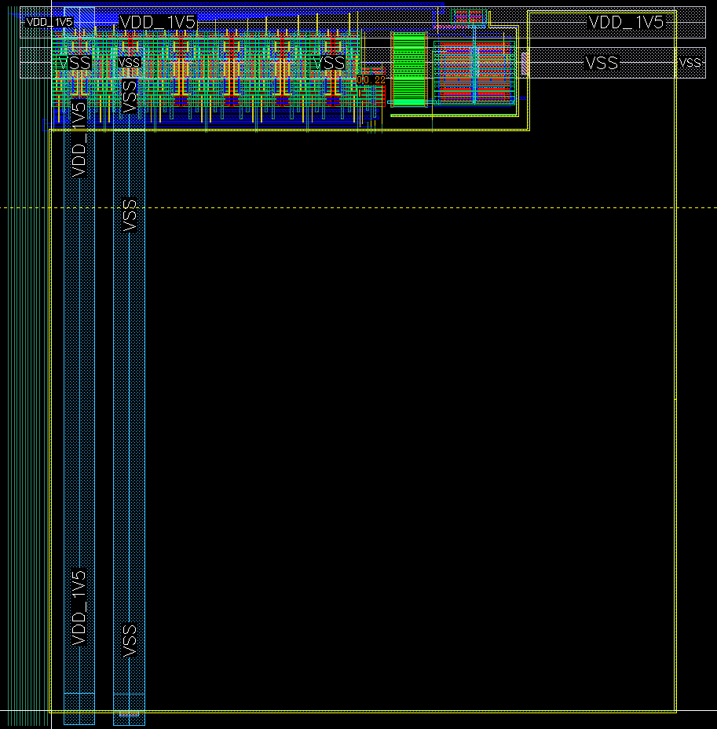
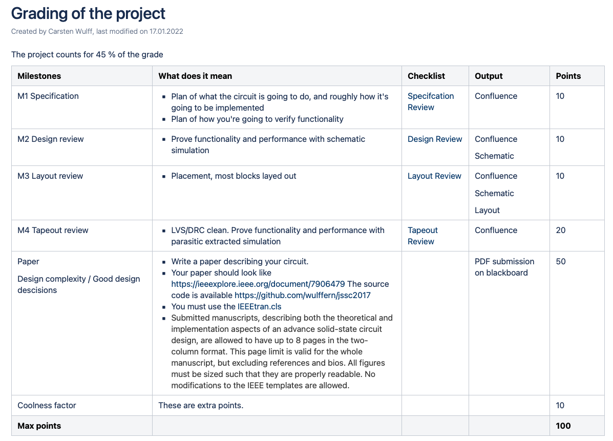

footer: Carsten Wulff 2022
slidenumbers:true
autoscale:true
theme: Plain Jane, 1
text:  Helvetica
header:  Helvetica

## TFE4188 - Lecture 3
# Reference and bias

---
# Housekeeping

Syllabus on [https://github.com/wulffern/aic2022/blob/main/syllabus.md](https://github.com/wulffern/aic2022/blob/main/syllabus.md)

Area of your design is constrained by SUN\_AS\_WRAP. You must all use that cell!

Specification review next week, you must follow the [Spec checklist](https://www.ntnu.no/wiki/display/tfe4487/Specifcation+Review)

Grading of the project includes the specification review

---

---

---
| Week | Book                 | Monday                                                                       | Project plan             | Exercise |
|------|----------------------|------------------------------------------------------------------------------|--------------------------|----------|
| 2    | CJM 1-6              | Course intro, what I expect you to know, project, analog design fundamentals | Specification            |          |
| 3    | Slides               | ESD and IC Input/Output                                                      | Specification            | x        |
| 4    | CJM 7,8              | **Reference and bias**                                                           | Specification            |          |
| 5    | CJM 12               | Analog Front-end                                                             | M1. Specification review | x        |
| 6    | CJM 11-14            | Switched capacitor circuits                                                  | Design                   |          |
| 7    | JSSC, CJM 18         | State-of-the-art ADCs                                                        | Design                   | x        |
| 8    | Slides               | Low power radio recievers                                                    | Design                   |          |
| 9    | Slides               | Communication standards from circuit perspective                             | M2. Design review        | x        |
| 10   | CJM 7.4, CFAS,+DC/DC | Voltage regulation                                                           | Layout                   |          |
| 11   | CJM 19, CFAS         | Clock generation                                                             | M3. Layout review        | x        |
| 12   | Paper                | Energy sources                                                               | Layout/LPE simulation    |          |
| 13   | Slides               | Chip infrastructure                                                          | Layout/LPE simulation    | x        |
| 14   |                      | Tapeout review                                                               | M4. Tapeout review       |          |
| 15   |                      | Easter                                                                       |                          |          |
| 16   |                      | Easter                                                                       |                          |          |
| 17   |                      | Exam repetition                                                              |                          |          |

---
# Goal for today

Understand **why** we need reference and bias circuits

Introduction to **circuit architectures** 

---

#[fit] Why

---

---

---

---

## What quantity do we have access to on an IC that is independent of PVT?

....

---

#[fit] Bandgap voltage reference

---

---

<!--
$$ V_{out} = V_{G0} + (m-1)\frac{kT}{q}\ln{\frac{T_0}{T}} +T\left[\frac{k}{q}\ln{\frac{J_2}{J_1}}\frac{2R2}{R1} - \frac{V_{G0}- V_{be0}}{T_0}\right] $$

$$ \frac{R2}{R1} = \frac{V_{G0} - V_{be0}}{2 T_0 \frac{k}{q}\ln(\frac{J_2}{J_1})}$$ -->

---
`sun/sun_bias_gf130n/go/`

---
`sun/sun_bias_gf130n/design/SUN_BIAS_GF130N/SUN_BIAS_CORE`

---

---

   

---

---

#[fit] Low voltage bandgap

---

 

---

 

---

 

---

 

---

#[fit] Bias
 Sometimes we just need a current 

---

---

---

---

#[fit] Thanks!

---
