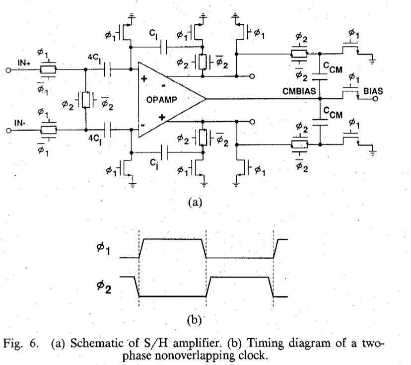
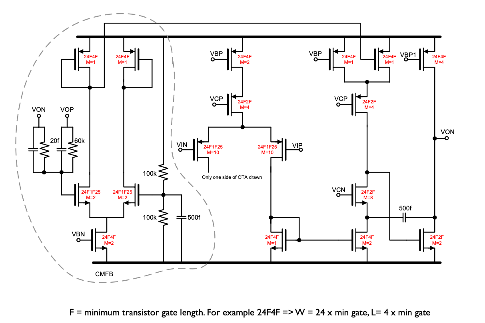
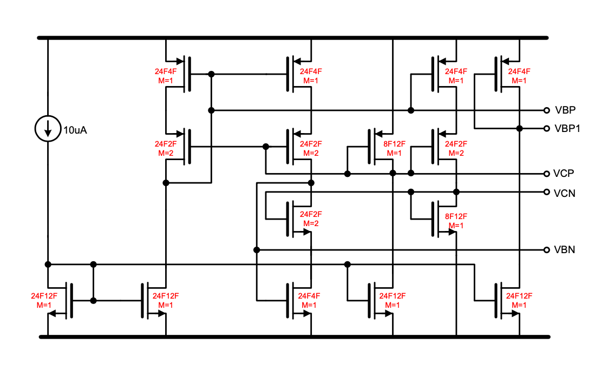
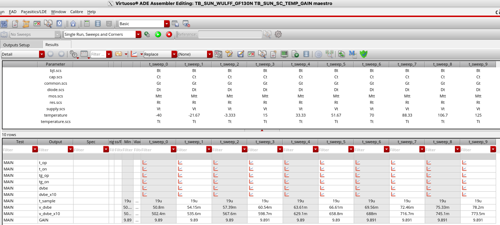

footer: Carsten Wulff 2022
slidenumbers:true
autoscale:true
theme: Plain Jane, 1
text:  Helvetica
header:  Helvetica

## TFE4188 - Lecture 5
# Switched-Capacitor Circuits

---
# Housekeeping

---

| Week | Book                 | Monday                                                                       | Project plan             | Exercise |
|------|----------------------|------------------------------------------------------------------------------|--------------------------|----------|
| 2    | CJM 1-6              | Course intro, what I expect you to know, project, analog design fundamentals | Specification            |          |
| 3    | Slides               | ESD and IC Input/Output                                                      | Specification            | x        |
| 4    | CJM 7,8              | Reference and bias                                                           | Specification            |          |
| 5    | CJM 12               | Analog Front-end                                                           | M1. Specification review | x        |
| 6    | CJM 11-14            | **Switched capacitor circuits**                                                  | Design                   |          |
| 7    | JSSC, CJM 18         | State-of-the-art ADCs                                                        | Design                   | x        |
| 8    | Slides               | Low power radio recievers                                                    | Design                   |          |
| 9    | Slides               | Communication standards from circuit perspective                             | M2. Design review        | x        |
| 10   | CJM 7.4, CFAS,+DC/DC | Voltage regulation                                                           | Layout                   |          |
| 11   | CJM 19, CFAS         | Clock generation                                                             | M3. Layout review        | x        |
| 12   | Paper                | Energy sources                                                               | Layout/LPE simulation    |          |
| 13   | Slides               | Chip infrastructure                                                          | Layout/LPE simulation    | x        |
| 14   |                      | Tapeout review                                                               | M4. Tapeout review       |          |
| 15   |                      | Easter                                                                       |                          |          |
| 16   |                      | Easter                                                                       |                          |          |
| 17   |                      | Exam repetition                                                              |                          |          |

---
# Goal for today

Understand **why** we sometimes need switched capacitor circuits

Introduction to **discrete-time**, and **switched capacitor**

---

#[fit] Why

---

[.column]
# Active-RC
--

#[fit] $$\omega_{p|z} \propto \frac{1}{RC}$$

[.column]
# Gm-C

--

#[fit] $$\omega_{p|z} \propto \frac{G_m}{C}$$

---

#[fit] $$\omega_{p|z} \propto \frac{C_1}{C_2}$$

---

[A pipelined 5-Msample/s 9-bit analog-to-digital converter](https://ieeexplore.ieee.org/document/1052843)

Good common-mode rejection

Precise gain

---
# Nano-scale CMOS
[.column]

**Advantage** 

Switches become smaller (less charge injection)

Capacitors become more dense 

[.column]
**Challenge**

High-gain OTA's (tricky to get 100 dB open loop gain)

---

# Discrete-Time Signals
---

[.column]

Define $$ x_c$$ as a continuous time signal, continuous value signal

Define $$ 
\ell(t) = \begin{cases}
1 & \text{if } t \geq 0 \\
0 & \text{if } t < 0
\end{cases}
$$

Define $$ x_{sn}(t) = \frac{x_c(nT)}{\tau}[\ell(t-nT) - \ell(t - nT - \tau)]$$

Define $$ x_s(t) = \sum_{n=-\infty}^{\infty}{x_{sn}(t)}$$

[.column]

A sampled signal of an analog signal you can think of it as an infinite sum of pulse trains where the area under the pulse train is equal to the analog signal. 

__Why do this?__

---

[.column]

If $$ x_s(t) = \sum_{n=-\infty}^{\infty}{x_{sn}(t)}$$

Then $$ X_{sn}(s) = \frac{1}{\tau}\frac{1 - e^{-s\tau}}{s} x_c(nT)e^{-snT} $$

And  $$ X_s(s) = \frac{1}{\tau}\frac{1 - e^{-s\tau}}{s} \sum_{n=-\infty}^{\infty}x_c(nT)e^{-snT}$$

Thus $$ \lim_{\tau \to 0} \rightarrow X_s(s) = \sum_{n=-\infty}^{\infty}x_c(nT)e^{-snT}$$

Or $$ X_s(j\omega) = \frac{1}{T}\sum_{k=-\infty}^{\infty} X_c\left(j\omega - \frac{j k 2 \pi}{T}\right)$$

[.column]

**The spectrum of a sampled signal is an infinite sum of frequency shifted spectra!**

or equivalenty

**When you sample a signal, then there will be copies of the input spectrum at every $$ nf_s$$**

However, if you do an FFT of a sampled signal, then all those infinite spectra will fold down between $$ 0 \to f_s/2$$ or $$- f_s/2 \to f_s/2$$ for a complex FFT

---

---

---

---

[.column]

$$ X_s(s) = \sum_{n=-\infty}^{\infty}x_c(nT)e^{-snT}$$
$$ X_s(z) = \sum_{n=-\infty}^{\infty}x_c[n]z^{-n}$$

[.column]

For discrete time signal processing we use Z-transform

If you're unfamiliar with the Z-transform, read the book or search [https://en.wikipedia.org/wiki/Z-transform](https://en.wikipedia.org/wiki/Z-transform)

---

#[fit] Pole-Zero plots

If you're not comfortable with pole/zero plots, have a look at 

[What does the Laplace Transform really tell us](https://www.youtube.com/watch?v=n2y7n6jw5d0)

---
#[fit] Z-domain

Spectra repeat every $$2\pi$$ (every $$f_s$$)

Bi-linear transform 

$$ s = \frac{z -1}{z + 1}$$

Warning: First-order approximation [https://en.wikipedia.org/wiki/Bilinear_transform](https://en.wikipedia.org/wiki/Bilinear_transform)

---
# First order filter 

$$ y[n+1] = bx[n] + ay[n] \Rightarrow y z = b x + a y$$

$$ y[n] = b x[n-1] + ay[n-1] \Rightarrow y = b x z^{-1} + a y z^{-1}  $$ 

$$ H(z) = \frac{b}{z-a}$$

Infinite-impulse response (IIR)

$$ h[n] = \begin{cases} k & \text{if } n < 1 \\ a^{n-1}b + a^n k & \text{if } n \geq 1 \end{cases}$$

 Head's up: Fig 13.12 in AIC is wrong 

---

# Finite-impulse response(FIR)

$$ H(z) = \frac{1}{3}\sum_{i=0}^2 z^{-1}$$

Always stable! 

---

#[fit] Switched-Capacitor

---

---

**What do we need?**

---

#[fit] OTA

---

---

---

#[fit] Switches

---

---

---

---

#[fit] Non-overlapping clocks

---

---

---

#[fit] Principles

---

---

---

$$ V_o[n+1] = \frac{C_1}{C_2}V_i[n]$$

$$ V_o z = \frac{C_1}{C_2} V_i$$

$$ \frac{V_o}{V_i} = H(z) = \frac{C_1}{C_2}z^{-1}$$

---

---

---

$$ V_o[n] = V_o[n-1] + \frac{C_1}{C_2}V_i[n-1]$$

$$V_o - z^{-1}V_o = \frac{C_1}{C_2}z^{-1}V_i $$

$$ H(z) = \frac{C_1}{C_2}\frac{z^{-1}}{z^{-1} + 1} =
\frac{C_1}{C_2}\frac{1}{z-1} $$

---

#[fit] $$ H(z) =\frac{C_1}{C_2}\frac{1}{z-1} $$

---

#[fit] Noise

---

---

#[fit] Both phases add noise! $$ V_n^2 > \frac{2 k T}{C}$$

---
[.background-color: #000000]
[.text: #FFFFFF]

[.column]

[Mean](https://en.wikipedia.org/wiki/Mean)
$$ \overline{x(t)} = \lim_{T\to\infty} \frac{1}{T}\int^{+T/2}_{-T/2}{ x(t) dt} $$

Mean Square
$$ \overline{x^2(t)} = \lim_{T\to\infty} \frac{1}{T}\int^{+T/2}_{-T/2}{ x^2(t) dt} $$

[Variance](https://en.wikipedia.org/wiki/Variance)
$$ \sigma^2 = \overline{x^2(t)} - \overline{x(t)}^2$$

where $$\sigma$$ is the standard deviation.
If mean is removed, or is zero, then
$$ \sigma^2 = \overline{x^2(t)} $$

[.column]
Assume two random processes, $$x_1(t)$$ and $$x_2(t)$$ with mean of zero (or removed).
 $$ x_{tot}(t) =  x_1(t) + x_2(t)$$
 $$ x_{tot}^2(t) = x_1^2(t) + x_2^2(t) + 2x_1(t)x_2(t)$$

Variance (assuming mean of zero) 
$$ \sigma^2_{tot} = \lim_{T\to\infty} \frac{1}{T}\int^{+T/2}_{-T/2}{ x_{tot}^2(t) dt} $$
$$ \sigma^2_{tot} = \sigma_1^2 + \sigma_2^2 + \lim_{T\to\infty} \frac{1}{T}\int^{+T/2}_{-T/2}{ 2x_1(t)x_2(t) dt} $$

**Assuming uncorrelated processes (covariance is zero), then
$$ \sigma^2_{tot} = \sigma_1^2 + \sigma_2^2  $$**

---

#[fit] Example

---

---

---

---

---

---

# In the book that you really should read

Parasitic sensitive integrator

Gain circuit that zero's OTA offset

Correlated double sampling

VCO

Peak detectors

---

#[fit] Thanks!

---
