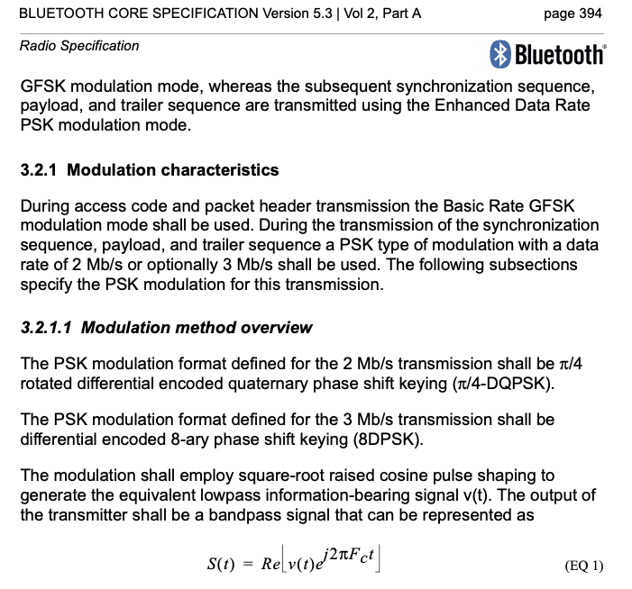
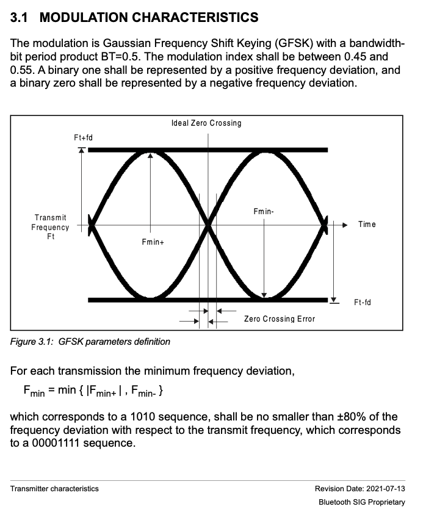
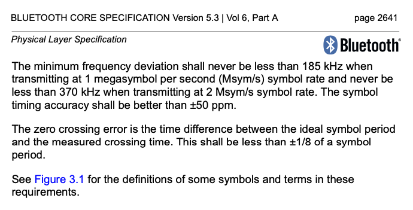
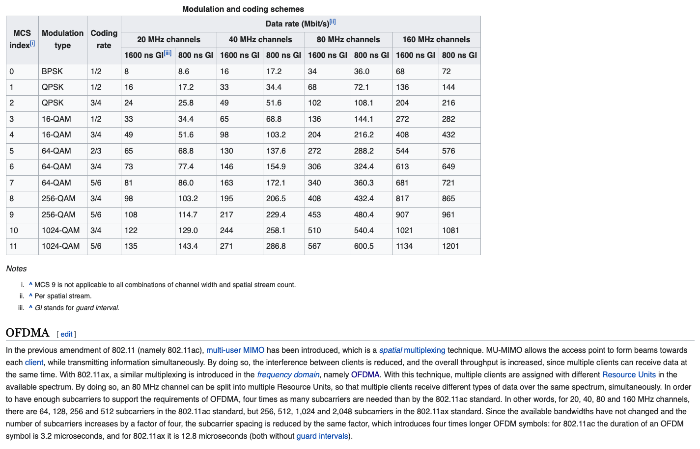
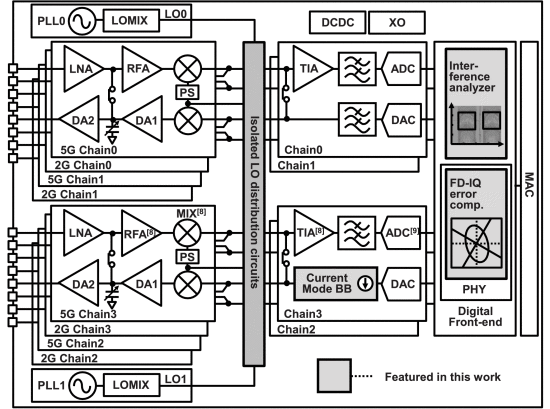
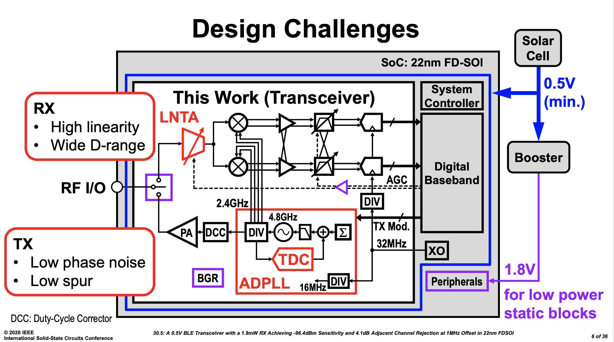

footer: Carsten Wulff 2021
slidenumbers:true
autoscale:true
theme:Plain Jane,1

# TFE4188 - Lecture 8
# Communication standards from a circuit perspective

---

| Week | Book                 | Monday                                                                       | Project plan             | Exercise |
|------|----------------------|------------------------------------------------------------------------------|--------------------------|----------|
| 2    | CJM 1-6              | Course intro, what I expect you to know, project, analog design fundamentals | Specification            |          |
| 3    | Slides               | ESD and IC Input/Output                                                      | Specification            | x        |
| 4    | CJM 7,8              | Reference and bias                                                           | Specification            |          |
| 5    | CJM 12               | Analog Front-end                                                             | M1. Specification review | x        |
| 6    | CJM 11-14            | Switched capacitor circuits                                                  | Design                   |          |
| 7    | JSSC, CJM 18         | State-of-the-art ADCs                                                 | Design                   | x        |
| 8    | Slides               | Low power radio recievers                                                    | Design                   |          |
| 9    | Slides               | **Communication standards from circuit perspective**                             | M2. Design review        | x        |
| 10   | CJM 7.4, CFAS,+DC/DC | Voltage regulation                                                           | Layout                   |          |
| 11   | CJM 19, CFAS         | Clock generation                                                             | M3. Layout review        | x        |
| 12   | Paper                | Energy sources                                                               | Layout/LPE simulation    |          |
| 13   | Slides               | Chip infrastructure                                                          | Layout/LPE simulation    | x        |
| 14   |                      | Tapeout review                                                               | M4. Tapeout review       |          |
| 15   |                      | Easter                                                                       |                          |          |
| 16   |                      | Easter                                                                       |                          |          |
| 17   |                      | Exam repetition                                                              |                          |          |

---

# Goal

Refresh BPSK, GFSK, QPSK, 8PSK, QAM, OFDM modulation schemes

Understand modulation **implications** for circuit architecture

---

---

$$ A = \sqrt{1 + 1} = \sqrt{2}$$

$$ \phi = 45^o  = \frac{\pi}{4}$$

$$ x = \sqrt{2}e^{j \frac{\pi}{4}}$$

$$ = \sqrt{2}\left( cos{\frac{\pi}{4}} + j sin{\frac{\pi}{4}} \right)$$

$$ = \sqrt{2}\left( \frac{\sqrt 2}{2} + j \frac{\sqrt 2}{2} \right)$$

$$ = 1 + j $$

---

---

---

---

---

---

---

---

---

---

---

[.column]
# Bluetooth BR/EDR 

1Mbps GFSK/$$\frac{\pi}{4}$$DPSK/8DPSK

Mostly used for audio, older devices

[.column]
# Bluetooth Low Energy

1 Mbps GFSK

2 Mbps GFSK

All other Bluetooth devices

What Nordic makes

---

---

---

---

---

---

#[fit] Thanks!
