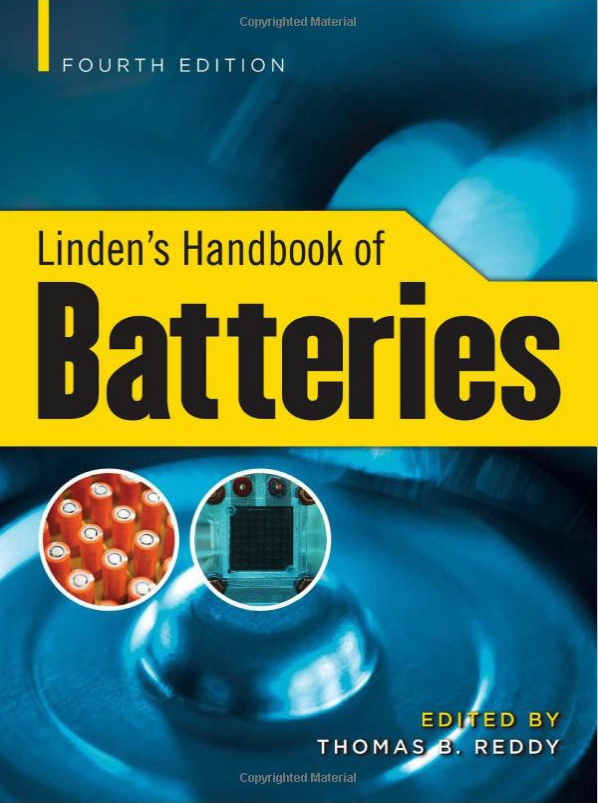
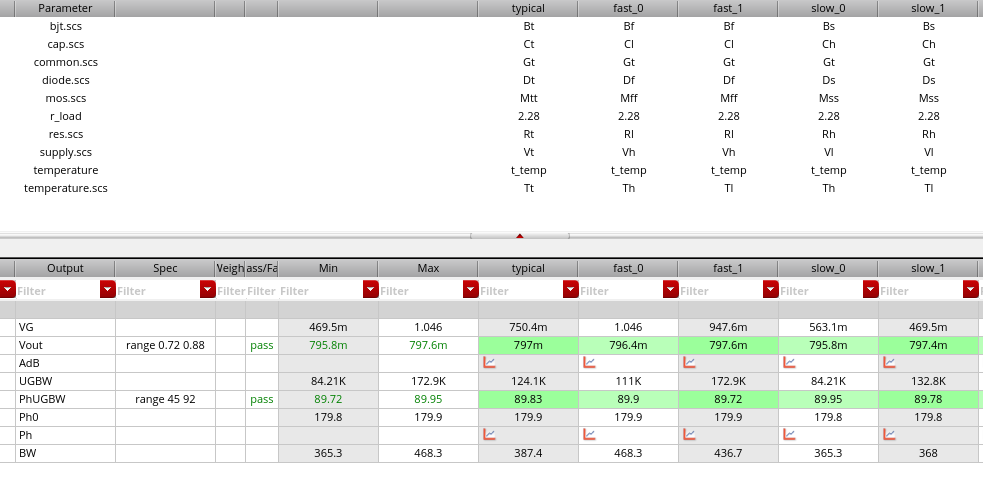
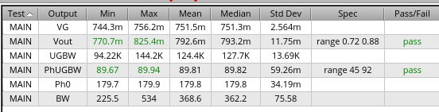
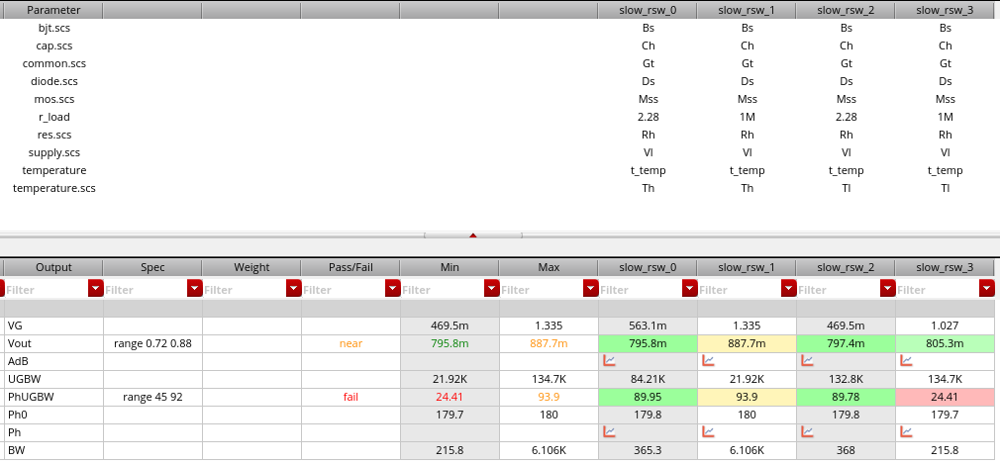
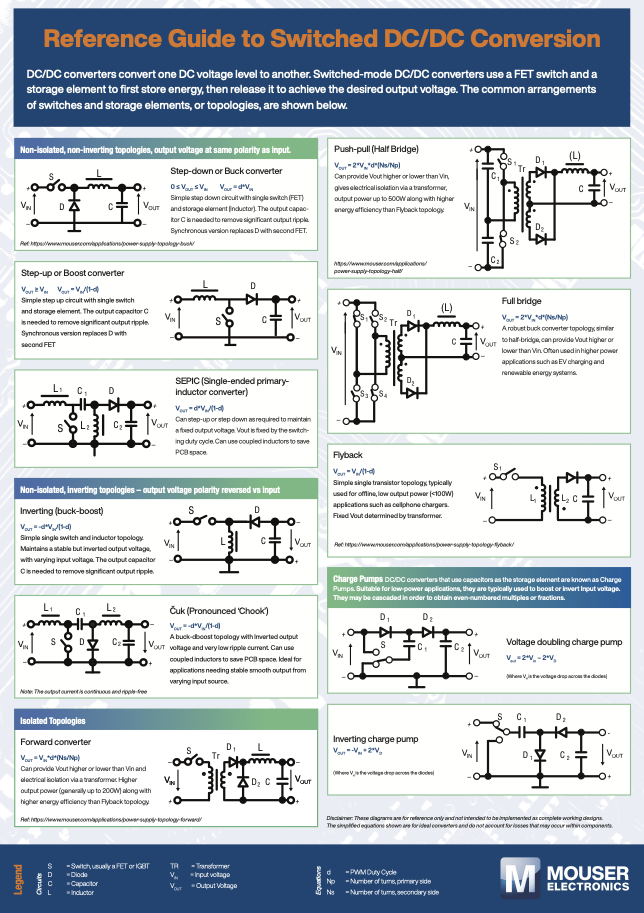
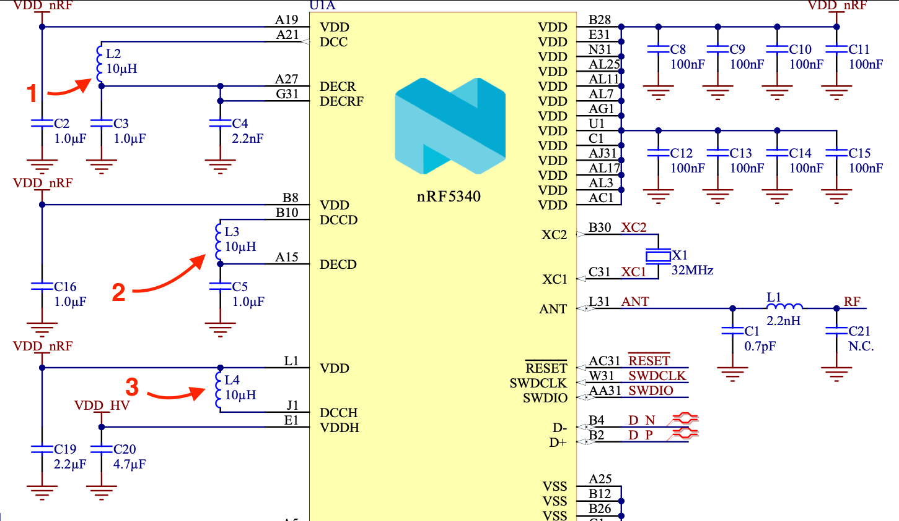

footer: Carsten Wulff 2021
slidenumbers:true
autoscale:true
theme:Plain Jane,1

# TFE4188 - Lecture 9
# Voltage regulation

---

| Week | Book                 | Monday                                                                       | Project plan             | Exercise |
|------|----------------------|------------------------------------------------------------------------------|--------------------------|----------|
| 2    | CJM 1-6              | Course intro, what I expect you to know, project, analog design fundamentals | Specification            |          |
| 3    | Slides               | ESD and IC Input/Output                                                      | Specification            | x        |
| 4    | CJM 7,8              | Reference and bias                                                           | Specification            |          |
| 5    | CJM 12               | Analog Front-end                                                             | M1. Specification review | x        |
| 6    | CJM 11-14            | Switched capacitor circuits                                                  | Design                   |          |
| 7    | JSSC, CJM 18         | State-of-the-art ADCs                                                 | Design                   | x        |
| 8    | Slides               | Low power radio recievers                                                    | Design                   |          |
| 9    | Slides               | Communication standards from circuit perspective                             | M2. Design review        | x        |
| 10   | CJM 7.4, CFAS,+DC/DC | **Voltage regulation**                                                           | Layout                   |          |
| 11   | CJM 19, CFAS         | Clock generation                                                             | M3. Layout review        | x        |
| 12   | Paper                | Energy sources                                                               | Layout/LPE simulation    |          |
| 13   | Slides               | Chip infrastructure                                                          | Layout/LPE simulation    | x        |
| 14   |                      | Tapeout review                                                               | M4. Tapeout review       |          |
| 15   |                      | Easter                                                                       |                          |          |
| 16   |                      | Easter                                                                       |                          |          |
| 17   |                      | Exam repetition                                                              |                          |          |

---

# Goal

**Why** do we need voltage regulation

Introduction to **linear regulators**

Introduction to **switched regulators**

---

#[fit] Why

---

# Voltage source

|  |Chemistry|  Voltage [V] |
|----|:----|----:|
| Primary Cell| LiFeS2 + Zn/Alk/MnO2 + LiMnO2  | 0.8 - 3.6 |
| Secondary Cell| Li-Ion | 2.5 - 4.3 |
| USB | - | 4.0 - 6.5 (20)|

---

[.column]
## Core 

| Node [nm] | Voltage [V] |
|:---------:|:-----------:|
| 180       | 1.8         |
| 130       | 1.5         |
| 55        | 1.2         |
| 22        | 0.8         |

[.column]
## IO 
| Voltage [V]|
| ----:|
|5.0|
|**3.0**|  
|*1.8*|
|1.2|

---

---

| Name      | Min [nA] | Max [mA] |
|:---------:|:--------:|:--------:|
| VDD\_VBUS | 10       | 500      |
| VDD\_VBAT | 10       | 400      |
| VDD\_IO   | 10       | 50       |
| VDD\_CORE | 10       | 350      |

---

---

#[fit] Linear Regulators

---

---

# What is the PMOS size?

Assume 350 mA load. Assume transistors are similar to GF130N. 

From SUN\_TR\_GF130N readme at GMID = 10

| Device | Id (Min) | Id (Max) | Vgs (Min) | Vgs (Max) |
|:------:|----------|----------|-----------|-----------|
| PCHDL  | 5 uA     | 10 uA    | 503       | 827       |
| NCHDL  | 15 uA    | 30 uA    | 555       | 848       |

$$V_{eff} = 2/(g_m/I_D) = 2/10 = 0.2$$

$$ V_{th_{max}} \approx 650 \text{ mV }$$  

---

 $$V_{eff} = 2/(g_m/I_D) = 2/10 = 0.2$$

 $$ V_{th_{max}} \approx 650 \text{ mV }$$  

 $$V_{gs_{max}} = 1.35 - 0.2 = 1.15$$

 $$V_{eff_{max}} = 1.15 - 0.65 = 0.5 $$

 $$ G_{m_{max}} = 10*0.2/0.5 = 4 $$ 

---

| Device | Id (Min) | Id (Max) | Vgs (Min) | Vgs (Max) |
|:------:|----------|----------|-----------|-----------|
| PCHDL  | 5 uA     | 10 uA    | 503       | 827       |
| NCHDL  | 15 uA    | 30 uA    | 555       | 848       |

Assume GMID = 4 at 350 mA load

| Device | Unit I_D | Number | Total W |
|:------:|----------|--------|---------|
| PCHDL  | 12.5 uA    | 28 k   | 21.8 mm |
| NCHDL  | 37.5 uA    | 9.3 k | 7.3 mm  |

---

#[fit] SUN\_WULFF\_GF130N/SUN\_LDO\_PMOS

---

---

---

---

---

---

| Device | Unit I_D | Number | Total W |
|:------:|----------|--------|---------|
| PCHDL  | 12.5 uA    | 28 k   | 21.8 mm |
| NCHDL  | 37.5 uA    | 9.3 k | 7.3 mm  |

---

#[fit]LDO's in JSSC

---

---

---

---

---

---

---

---

#[fit] Switched Regulators

---

[Reference Guide to Switched DC/DC Conversion](https://emea.info.mouser.com/dc-dc-converter-guide?cid=homepage&pid=mouser)

---

# Inductive DC/DC converters

---

---

---

---

---

#[fit] SUN\_WULFF\_GF130N/SUN\_BUCK

---

---

---

---

#[fit] BUCKs in JSSC

---

---

---

---

---

---

#[fit] Thanks!
